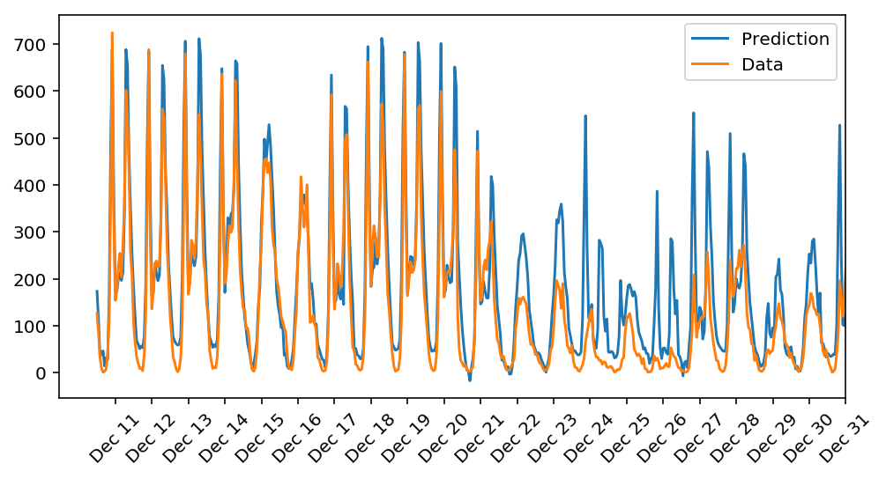

# Your first neural network

In this project, you'll build your first neural network and use it to predict daily bike rental ridership. We've provided some of the code, but left the implementation of the neural network up to you (for the most part). After you've submitted this project, feel free to explore the data and the model more.

### FEEDBACK

Nice dark theme! That's the first time I've seen that. You were very close for this assignment, but there are a couple small changes that need to take place.

Here you can install it ^^

> https://github.com/dunovank/jupyter-themes

> pip install jupyterthemes


#### Required Changes 

** The error propagated back to the hidden layer is implemented correctly **

OK a slight error here. You've applied the gradient too soon! The output of the network is fine, but I'm going to be a stickler for the intermediate steps.

Take the gradient term and move it to the hidden_grad variable. And the hidden_errors will be fine. 

**Updates to both the weights are implemented correctly.**

This will change according to the other changes I have asked for. The inputs layer should be incorporated in your self.weight_input_to_hidden update.

#### Comment

No need to excuse for being a "stickler" getting it right now, will prevent me from using the wrong data, when I have more layers stacked. 


```python
%matplotlib inline
%config InlineBackend.figure_format = 'retina'

import numpy as np
import pandas as pd
import matplotlib.pyplot as plt
```

## Load and prepare the data

A critical step in working with neural networks is preparing the data correctly. Variables on different scales make it difficult for the network to efficiently learn the correct weights. Below, we've written the code to load and prepare the data. You'll learn more about this soon!


```python
data_path = 'Bike-Sharing-Dataset/hour.csv'

rides = pd.read_csv(data_path)
```


```python
rides.head()
```


<div>
<table border="1" class="dataframe">
  <thead>
    <tr style="text-align: right;">
      <th></th>
      <th>instant</th>
      <th>dteday</th>
      <th>season</th>
      <th>yr</th>
      <th>mnth</th>
      <th>hr</th>
      <th>holiday</th>
      <th>weekday</th>
      <th>workingday</th>
      <th>weathersit</th>
      <th>temp</th>
      <th>atemp</th>
      <th>hum</th>
      <th>windspeed</th>
      <th>casual</th>
      <th>registered</th>
      <th>cnt</th>
    </tr>
  </thead>
  <tbody>
    <tr>
      <th>0</th>
      <td>1</td>
      <td>2011-01-01</td>
      <td>1</td>
      <td>0</td>
      <td>1</td>
      <td>0</td>
      <td>0</td>
      <td>6</td>
      <td>0</td>
      <td>1</td>
      <td>0.24</td>
      <td>0.2879</td>
      <td>0.81</td>
      <td>0.0</td>
      <td>3</td>
      <td>13</td>
      <td>16</td>
    </tr>
    <tr>
      <th>1</th>
      <td>2</td>
      <td>2011-01-01</td>
      <td>1</td>
      <td>0</td>
      <td>1</td>
      <td>1</td>
      <td>0</td>
      <td>6</td>
      <td>0</td>
      <td>1</td>
      <td>0.22</td>
      <td>0.2727</td>
      <td>0.80</td>
      <td>0.0</td>
      <td>8</td>
      <td>32</td>
      <td>40</td>
    </tr>
    <tr>
      <th>2</th>
      <td>3</td>
      <td>2011-01-01</td>
      <td>1</td>
      <td>0</td>
      <td>1</td>
      <td>2</td>
      <td>0</td>
      <td>6</td>
      <td>0</td>
      <td>1</td>
      <td>0.22</td>
      <td>0.2727</td>
      <td>0.80</td>
      <td>0.0</td>
      <td>5</td>
      <td>27</td>
      <td>32</td>
    </tr>
    <tr>
      <th>3</th>
      <td>4</td>
      <td>2011-01-01</td>
      <td>1</td>
      <td>0</td>
      <td>1</td>
      <td>3</td>
      <td>0</td>
      <td>6</td>
      <td>0</td>
      <td>1</td>
      <td>0.24</td>
      <td>0.2879</td>
      <td>0.75</td>
      <td>0.0</td>
      <td>3</td>
      <td>10</td>
      <td>13</td>
    </tr>
    <tr>
      <th>4</th>
      <td>5</td>
      <td>2011-01-01</td>
      <td>1</td>
      <td>0</td>
      <td>1</td>
      <td>4</td>
      <td>0</td>
      <td>6</td>
      <td>0</td>
      <td>1</td>
      <td>0.24</td>
      <td>0.2879</td>
      <td>0.75</td>
      <td>0.0</td>
      <td>0</td>
      <td>1</td>
      <td>1</td>
    </tr>
  </tbody>
</table>
</div>


## Checking out the data

This dataset has the number of riders for each hour of each day from January 1 2011 to December 31 2012. The number of riders is split between casual and registered, summed up in the `cnt` column. You can see the first few rows of the data above.

Below is a plot showing the number of bike riders over the first 10 days in the data set. You can see the hourly rentals here. This data is pretty complicated! The weekends have lower over all ridership and there are spikes when people are biking to and from work during the week. Looking at the data above, we also have information about temperature, humidity, and windspeed, all of these likely affecting the number of riders. You'll be trying to capture all this with your model.


```python
rides[:24*10].plot(x='dteday', y='cnt')
```


    <matplotlib.axes._subplots.AxesSubplot at 0x10abff208>


### Dummy variables
Here we have some categorical variables like season, weather, month. To include these in our model, we'll need to make binary dummy variables. This is simple to do with Pandas thanks to `get_dummies()`.


```python
dummy_fields = ['season', 'weathersit', 'mnth', 'hr', 'weekday']
for each in dummy_fields:
    dummies = pd.get_dummies(rides[each], prefix=each, drop_first=False)
    rides = pd.concat([rides, dummies], axis=1)

fields_to_drop = ['instant', 'dteday', 'season', 'weathersit', 
                  'weekday', 'atemp', 'mnth', 'workingday', 'hr']
data = rides.drop(fields_to_drop, axis=1)
data.head()
```


<div>
<table border="1" class="dataframe">
  <thead>
    <tr style="text-align: right;">
      <th></th>
      <th>yr</th>
      <th>holiday</th>
      <th>temp</th>
      <th>hum</th>
      <th>windspeed</th>
      <th>casual</th>
      <th>registered</th>
      <th>cnt</th>
      <th>season_1</th>
      <th>season_2</th>
      <th>...</th>
      <th>hr_21</th>
      <th>hr_22</th>
      <th>hr_23</th>
      <th>weekday_0</th>
      <th>weekday_1</th>
      <th>weekday_2</th>
      <th>weekday_3</th>
      <th>weekday_4</th>
      <th>weekday_5</th>
      <th>weekday_6</th>
    </tr>
  </thead>
  <tbody>
    <tr>
      <th>0</th>
      <td>0</td>
      <td>0</td>
      <td>0.24</td>
      <td>0.81</td>
      <td>0.0</td>
      <td>3</td>
      <td>13</td>
      <td>16</td>
      <td>1</td>
      <td>0</td>
      <td>...</td>
      <td>0</td>
      <td>0</td>
      <td>0</td>
      <td>0</td>
      <td>0</td>
      <td>0</td>
      <td>0</td>
      <td>0</td>
      <td>0</td>
      <td>1</td>
    </tr>
    <tr>
      <th>1</th>
      <td>0</td>
      <td>0</td>
      <td>0.22</td>
      <td>0.80</td>
      <td>0.0</td>
      <td>8</td>
      <td>32</td>
      <td>40</td>
      <td>1</td>
      <td>0</td>
      <td>...</td>
      <td>0</td>
      <td>0</td>
      <td>0</td>
      <td>0</td>
      <td>0</td>
      <td>0</td>
      <td>0</td>
      <td>0</td>
      <td>0</td>
      <td>1</td>
    </tr>
    <tr>
      <th>2</th>
      <td>0</td>
      <td>0</td>
      <td>0.22</td>
      <td>0.80</td>
      <td>0.0</td>
      <td>5</td>
      <td>27</td>
      <td>32</td>
      <td>1</td>
      <td>0</td>
      <td>...</td>
      <td>0</td>
      <td>0</td>
      <td>0</td>
      <td>0</td>
      <td>0</td>
      <td>0</td>
      <td>0</td>
      <td>0</td>
      <td>0</td>
      <td>1</td>
    </tr>
    <tr>
      <th>3</th>
      <td>0</td>
      <td>0</td>
      <td>0.24</td>
      <td>0.75</td>
      <td>0.0</td>
      <td>3</td>
      <td>10</td>
      <td>13</td>
      <td>1</td>
      <td>0</td>
      <td>...</td>
      <td>0</td>
      <td>0</td>
      <td>0</td>
      <td>0</td>
      <td>0</td>
      <td>0</td>
      <td>0</td>
      <td>0</td>
      <td>0</td>
      <td>1</td>
    </tr>
    <tr>
      <th>4</th>
      <td>0</td>
      <td>0</td>
      <td>0.24</td>
      <td>0.75</td>
      <td>0.0</td>
      <td>0</td>
      <td>1</td>
      <td>1</td>
      <td>1</td>
      <td>0</td>
      <td>...</td>
      <td>0</td>
      <td>0</td>
      <td>0</td>
      <td>0</td>
      <td>0</td>
      <td>0</td>
      <td>0</td>
      <td>0</td>
      <td>0</td>
      <td>1</td>
    </tr>
  </tbody>
</table>
<p>5 rows × 59 columns</p>
</div>


### Scaling target variables
To make training the network easier, we'll standardize each of the continuous variables. That is, we'll shift and scale the variables such that they have zero mean and a standard deviation of 1.

The scaling factors are saved so we can go backwards when we use the network for predictions.


```python
quant_features = ['casual', 'registered', 'cnt', 'temp', 'hum', 'windspeed']
# Store scalings in a dictionary so we can convert back later
scaled_features = {}
for each in quant_features:
    mean, std = data[each].mean(), data[each].std()
    scaled_features[each] = [mean, std]
    data.loc[:, each] = (data[each] - mean)/std
```

### Splitting the data into training, testing, and validation sets

We'll save the last 21 days of the data to use as a test set after we've trained the network. We'll use this set to make predictions and compare them with the actual number of riders.


```python
# Save the last 21 days 
test_data = data[-21*24:]
data = data[:-21*24]

# Separate the data into features and targets
target_fields = ['cnt', 'casual', 'registered']
features, targets = data.drop(target_fields, axis=1), data[target_fields]
test_features, test_targets = test_data.drop(target_fields, axis=1), test_data[target_fields]
```

We'll split the data into two sets, one for training and one for validating as the network is being trained. Since this is time series data, we'll train on historical data, then try to predict on future data (the validation set).


```python
# Hold out the last 60 days of the remaining data as a validation set
train_features, train_targets = features[:-60*24], targets[:-60*24]
val_features, val_targets = features[-60*24:], targets[-60*24:]
```

## Time to build the network

Below you'll build your network. We've built out the structure and the backwards pass. You'll implement the forward pass through the network. You'll also set the hyperparameters: the learning rate, the number of hidden units, and the number of training passes.

The network has two layers, a hidden layer and an output layer. The hidden layer will use the sigmoid function for activations. The output layer has only one node and is used for the regression, the output of the node is the same as the input of the node. That is, the activation function is $f(x)=x$. A function that takes the input signal and generates an output signal, but takes into account the threshold, is called an activation function. We work through each layer of our network calculating the outputs for each neuron. All of the outputs from one layer become inputs to the neurons on the next layer. This process is called *forward propagation*.

We use the weights to propagate signals forward from the input to the output layers in a neural network. We use the weights to also propagate error backwards from the output back into the network to update our weights. This is called *backpropagation*.

> **Hint:** You'll need the derivative of the output activation function ($f(x) = x$) for the backpropagation implementation. If you aren't familiar with calculus, this function is equivalent to the equation $y = x$. What is the slope of that equation? That is the derivative of $f(x)$.

Below, you have these tasks:
1. Implement the sigmoid function to use as the activation function. Set `self.activation_function` in `__init__` to your sigmoid function.
2. Implement the forward pass in the `train` method.
3. Implement the backpropagation algorithm in the `train` method, including calculating the output error.
4. Implement the forward pass in the `run` method.
  


```python
class NeuralNetwork(object):
    def __init__(self, input_nodes, hidden_nodes, output_nodes, learning_rate):
        # Set number of nodes in input, hidden and output layers.
        self.input_nodes = input_nodes
        self.hidden_nodes = hidden_nodes
        self.output_nodes = output_nodes

        # Initialize weights
        self.weights_input_to_hidden = np.random.normal(0.0, self.hidden_nodes**-0.5, 
                                       (self.hidden_nodes, self.input_nodes))

        self.weights_hidden_to_output = np.random.normal(0.0, self.output_nodes**-0.5, 
                                       (self.output_nodes, self.hidden_nodes))
        self.lr = learning_rate
        
        #### Set this to your implemented sigmoid function ####
        # Activation function is the sigmoid function
        self.activation_function = lambda x : 1 / (1 + np.exp(-x))
    
    def train(self, inputs_list, targets_list):
        # Convert inputs list to 2d array
        inputs = np.array(inputs_list, ndmin=2).T
        targets = np.array(targets_list, ndmin=2).T
        
        #### Implement the forward pass here ####
        ### Forward pass ###
        # TODO: Hidden layer
        hidden_inputs = np.dot(self.weights_input_to_hidden,inputs) # signals into hidden layer
        hidden_outputs = self.activation_function(hidden_inputs) # signals from hidden layer
        
        # TODO: Output layer
        final_inputs = np.dot(self.weights_hidden_to_output,hidden_outputs) # signals into final output layer
        final_outputs = final_inputs # signals from final output layer
        
        #### Implement the backward pass here ####
        ### Backward pass ###
        
        # TODO: Output error
        output_errors = targets-final_outputs # Output layer error is the difference between desired target and actual output.
        
        # TODO: Backpropagated error
        #### PROBLEM ####
        # OK a slight error here. You've applied the gradient too soon! The output of the network is fine, but I'm going to be a stickler for the intermediate steps.
        # Take the gradient term and move it to the hidden_grad variable. And the hidden_errors will be fine. 
        #### OLD ####
        # hidden_errors = np.dot(self.weights_hidden_to_output.T,output_errors) * (hidden_outputs)* (1-hidden_outputs) # errors propagated to the hidden layer
        # hidden_grad = hidden_errors*inputs.T # hidden layer gradients
        #### NEW ####
        hidden_errors = np.dot(self.weights_hidden_to_output.T,output_errors) # errors propagated to the hidden layer
        hidden_grad = (hidden_outputs)*(1-hidden_outputs) # hidden layer gradients
        #### Comment ####
        # No need to excuse for being a "stickler" getting it right now, will prevent me from using the wrong data, when I have more layers stacked. 
        
        # TODO: Update the weights
        self.weights_hidden_to_output += self.lr*output_errors*hidden_outputs.T# update hidden-to-output weights with gradient descent step
        
        #### PROBLEM ####
        # This will change according to the other changes I have asked for. The inputs layer should be incorporated in your self.weight_input_to_hidden update.
        #### OLD ####
        # self.weights_input_to_hidden += self.lr*hidden_grad # update input-to-hidden weights with gradient descent step
        #### NEW ####
        self.weights_input_to_hidden += self.lr*hidden_errors*hidden_grad*inputs.T # update input-to-hidden weights with gradient descent step
 

    def run(self, inputs_list):
        # Run a forward pass through the network
        inputs = np.array(inputs_list, ndmin=2).T
        
        #### Implement the forward pass here ####
        # TODO: Hidden layer
        hidden_inputs =  np.dot(self.weights_input_to_hidden,inputs) # signals into hidden layer
        hidden_outputs = self.activation_function(hidden_inputs) # signals from hidden layer
        
        # TODO: Output layer
        final_inputs = np.dot(self.weights_hidden_to_output,hidden_outputs) # signals into final output layer
        final_outputs = final_inputs # signals from final output layer
        
        return final_outputs
```


```python
def MSE(y, Y):
    return np.mean((y-Y)**2)
```

## Training the network

Here you'll set the hyperparameters for the network. The strategy here is to find hyperparameters such that the error on the training set is low, but you're not overfitting to the data. If you train the network too long or have too many hidden nodes, it can become overly specific to the training set and will fail to generalize to the validation set. That is, the loss on the validation set will start increasing as the training set loss drops.

You'll also be using a method know as Stochastic Gradient Descent (SGD) to train the network. The idea is that for each training pass, you grab a random sample of the data instead of using the whole data set. You use many more training passes than with normal gradient descent, but each pass is much faster. This ends up training the network more efficiently. You'll learn more about SGD later.

### Choose the number of epochs
This is the number of times the dataset will pass through the network, each time updating the weights. As the number of epochs increases, the network becomes better and better at predicting the targets in the training set. You'll need to choose enough epochs to train the network well but not too many or you'll be overfitting.

### Choose the learning rate
This scales the size of weight updates. If this is too big, the weights tend to explode and the network fails to fit the data. A good choice to start at is 0.1. If the network has problems fitting the data, try reducing the learning rate. Note that the lower the learning rate, the smaller the steps are in the weight updates and the longer it takes for the neural network to converge.

### Choose the number of hidden nodes
The more hidden nodes you have, the more accurate predictions the model will make. Try a few different numbers and see how it affects the performance. You can look at the losses dictionary for a metric of the network performance. If the number of hidden units is too low, then the model won't have enough space to learn and if it is too high there are too many options for the direction that the learning can take. The trick here is to find the right balance in number of hidden units you choose.

### Comment 
I will not run grid search cause it takes to long, but the rest of the unit.


```python
# I will not run grid search cause it takes to long, but the rest of the unit.
import sys

### Set the hyperparameters here ###
epochs = 1000
learning_rate = 0.01
hidden_nodes = 12
output_nodes = 1


losses = {'train':[], 'validation':[]}

#applying a grid search
for epochs in [100,500,1000]:
    for learning_rate in [0.1,0.01,0.001]:
        for hidden_nodes in [2,4,8,16]:
            N_i = train_features.shape[1]
            network = NeuralNetwork(N_i, hidden_nodes, output_nodes, learning_rate)
            print("epoches: {}, learning_rate:{}, hidden_nodes:{}".format(epochs,learning_rate,hidden_nodes))
            for e in range(epochs):
                # Go through a random batch of 128 records from the training data set
                batch = np.random.choice(train_features.index, size=128)
                for record, target in zip(train_features.ix[batch].values, 
                                          train_targets.ix[batch]['cnt']):
                    network.train(record, target)

                # Printing out the training progress
                train_loss = MSE(network.run(train_features), train_targets['cnt'].values)
                val_loss = MSE(network.run(val_features), val_targets['cnt'].values)
                sys.stdout.write("\rProgress: " + str(100 * e/float(epochs))[:4] \
                                 + "% ... Training loss: " + str(train_loss)[:5] \
                                 + " ... Validation loss: " + str(val_loss)[:5])

                losses['train'].append(train_loss)
                losses['validation'].append(val_loss)
            print("")
            print("")

    
    
```

    epoches: 100, learning_rate:0.1, hidden_nodes:2
    Progress: 99.0% ... Training loss: 0.266 ... Validation loss: 0.435
    
    epoches: 100, learning_rate:0.1, hidden_nodes:4
    Progress: 99.0% ... Training loss: 0.229 ... Validation loss: 0.321
    
    epoches: 100, learning_rate:0.1, hidden_nodes:8
    Progress: 99.0% ... Training loss: 0.149 ... Validation loss: 0.284
    
    epoches: 100, learning_rate:0.1, hidden_nodes:16
    Progress: 99.0% ... Training loss: 0.168 ... Validation loss: 0.282
    
    epoches: 100, learning_rate:0.01, hidden_nodes:2
    Progress: 99.0% ... Training loss: 0.618 ... Validation loss: 0.958
    
    epoches: 100, learning_rate:0.01, hidden_nodes:4
    Progress: 99.0% ... Training loss: 0.302 ... Validation loss: 0.481
    
    epoches: 100, learning_rate:0.01, hidden_nodes:8
    Progress: 99.0% ... Training loss: 0.297 ... Validation loss: 0.484
    
    epoches: 100, learning_rate:0.01, hidden_nodes:16
    Progress: 99.0% ... Training loss: 0.284 ... Validation loss: 0.437
    
    epoches: 100, learning_rate:0.001, hidden_nodes:2
    Progress: 99.0% ... Training loss: 0.957 ... Validation loss: 1.298
    
    epoches: 100, learning_rate:0.001, hidden_nodes:4
    Progress: 99.0% ... Training loss: 0.782 ... Validation loss: 1.299
    
    epoches: 100, learning_rate:0.001, hidden_nodes:8
    Progress: 99.0% ... Training loss: 0.587 ... Validation loss: 0.955
    
    epoches: 100, learning_rate:0.001, hidden_nodes:16
    Progress: 99.0% ... Training loss: 0.547 ... Validation loss: 0.898
    
    epoches: 500, learning_rate:0.1, hidden_nodes:2
    Progress: 99.8% ... Training loss: 0.251 ... Validation loss: 0.417
    
    epoches: 500, learning_rate:0.1, hidden_nodes:4
    Progress: 99.8% ... Training loss: 0.088 ... Validation loss: 0.175
    
    epoches: 500, learning_rate:0.1, hidden_nodes:8
    Progress: 99.8% ... Training loss: 0.072 ... Validation loss: 0.180
    
    epoches: 500, learning_rate:0.1, hidden_nodes:16
    Progress: 99.8% ... Training loss: 0.063 ... Validation loss: 0.169
    
    epoches: 500, learning_rate:0.01, hidden_nodes:2
    Progress: 99.8% ... Training loss: 0.228 ... Validation loss: 0.388
    
    epoches: 500, learning_rate:0.01, hidden_nodes:4
    Progress: 99.8% ... Training loss: 0.224 ... Validation loss: 0.364
    
    epoches: 500, learning_rate:0.01, hidden_nodes:8
    Progress: 99.8% ... Training loss: 0.191 ... Validation loss: 0.343
    
    epoches: 500, learning_rate:0.01, hidden_nodes:16
    Progress: 99.8% ... Training loss: 0.205 ... Validation loss: 0.386
    
    epoches: 500, learning_rate:0.001, hidden_nodes:2
    Progress: 99.8% ... Training loss: 0.631 ... Validation loss: 0.974
    
    epoches: 500, learning_rate:0.001, hidden_nodes:4
    Progress: 99.8% ... Training loss: 0.470 ... Validation loss: 0.858
    
    epoches: 500, learning_rate:0.001, hidden_nodes:8
    Progress: 99.8% ... Training loss: 0.341 ... Validation loss: 0.570
    
    epoches: 500, learning_rate:0.001, hidden_nodes:16
    Progress: 99.8% ... Training loss: 0.306 ... Validation loss: 0.491
    
    epoches: 1000, learning_rate:0.1, hidden_nodes:2
    Progress: 99.9% ... Training loss: 0.150 ... Validation loss: 0.245
    
    epoches: 1000, learning_rate:0.1, hidden_nodes:4
    Progress: 99.9% ... Training loss: 0.093 ... Validation loss: 0.219
    
    epoches: 1000, learning_rate:0.1, hidden_nodes:8
    Progress: 99.9% ... Training loss: 0.070 ... Validation loss: 0.200
    
    epoches: 1000, learning_rate:0.1, hidden_nodes:16
    Progress: 99.9% ... Training loss: 0.061 ... Validation loss: 0.159
    
    epoches: 1000, learning_rate:0.01, hidden_nodes:2
    Progress: 99.9% ... Training loss: 0.215 ... Validation loss: 0.336
    
    epoches: 1000, learning_rate:0.01, hidden_nodes:4
    Progress: 99.9% ... Training loss: 0.142 ... Validation loss: 0.271
    
    epoches: 1000, learning_rate:0.01, hidden_nodes:8
    Progress: 99.9% ... Training loss: 0.114 ... Validation loss: 0.236
    
    epoches: 1000, learning_rate:0.01, hidden_nodes:16
    Progress: 99.9% ... Training loss: 0.106 ... Validation loss: 0.228
    
    epoches: 1000, learning_rate:0.001, hidden_nodes:2
    Progress: 99.9% ... Training loss: 0.682 ... Validation loss: 1.136
    
    epoches: 1000, learning_rate:0.001, hidden_nodes:4
    Progress: 99.9% ... Training loss: 0.398 ... Validation loss: 0.762
    
    epoches: 1000, learning_rate:0.001, hidden_nodes:8
    Progress: 99.9% ... Training loss: 0.286 ... Validation loss: 0.445
    
    epoches: 1000, learning_rate:0.001, hidden_nodes:16
    Progress: 99.9% ... Training loss: 0.281 ... Validation loss: 0.471
    


For the chosen grid (which was more fore the demonstration of grid search - not for a complete one) the following parameters are optimal, the once with a better trainings score seems to overfit, so:

* epoches: 500
* learning_rate: 0.1
* hidden_notes: 16
* validation loss: 0.159

(1000,0.1,4 - 0,169 - is also a good choice, especially because it has only 4 hidden notes, thus is less complex)


```python
import sys

### Set the hyperparameters here ###
epochs = 1000
learning_rate = 0.1
hidden_nodes = 10
output_nodes = 1

N_i = train_features.shape[1]
network = NeuralNetwork(N_i, hidden_nodes, output_nodes, learning_rate)

losses = {'train':[], 'validation':[]}
for e in range(epochs):
    # Go through a random batch of 128 records from the training data set
    batch = np.random.choice(train_features.index, size=128)
    for record, target in zip(train_features.ix[batch].values, 
                              train_targets.ix[batch]['cnt']):
        network.train(record, target)
    
    # Printing out the training progress
    train_loss = MSE(network.run(train_features), train_targets['cnt'].values)
    val_loss = MSE(network.run(val_features), val_targets['cnt'].values)
    sys.stdout.write("\rProgress: " + str(100 * e/float(epochs))[:4] \
                     + "% ... Training loss: " + str(train_loss)[:5] \
                     + " ... Validation loss: " + str(val_loss)[:5])
    
    losses['train'].append(train_loss)
    losses['validation'].append(val_loss)


```

    Progress: 99.9% ... Training loss: 0.063 ... Validation loss: 0.175


```python
plt.plot(losses['train'], label='Training loss')
plt.plot(losses['validation'], label='Validation loss')
plt.legend()
plt.ylim(ymax=0.5)
```


    (0.0016512094997623641, 0.5)


## Check out your predictions

Here, use the test data to view how well your network is modeling the data. If something is completely wrong here, make sure each step in your network is implemented correctly.


```python
fig, ax = plt.subplots(figsize=(8,4))

mean, std = scaled_features['cnt']
predictions = network.run(test_features)*std + mean
ax.plot(predictions[0], label='Prediction')
ax.plot((test_targets['cnt']*std + mean).values, label='Data')
ax.set_xlim(right=len(predictions))
ax.legend()

dates = pd.to_datetime(rides.ix[test_data.index]['dteday'])
dates = dates.apply(lambda d: d.strftime('%b %d'))
ax.set_xticks(np.arange(len(dates))[12::24])
_ = ax.set_xticklabels(dates[12::24], rotation=45)
```





## Thinking about your results
 
Answer these questions about your results. How well does the model predict the data? Where does it fail? Why does it fail where it does?

> **Note:** You can edit the text in this cell by double clicking on it. When you want to render the text, press control + enter

#### Your answer below

In general the a model can only predict events following the learned patterns. But some events do not follow those patterns, every time people behave differently than they did in the past could lead to outliers in the data or e.g. very cheap gas for a long term changing trend, were the model has to be trained again, because more people go by car again or a new public transportation line ... . Looking at the anomalies we can find out what happens on that day, maybe many roads have been floded or a special event from another rental service (were the bikes were very cheap) or a come to work with your bike event in the city are examples for such events. 

To sum it up:
 * unpredictable events (single bias)
 * system changed (long term bias)
 
Another important factor, in the particular case, seems to be the x-mas holidays. I can only guess, but during the x-mas time more people are driving by bike as during other holidays, maybe because of family trips, maybe the seasons are not accurate enough or for some reason the this x-mas is special because of the weather (which is taken into account in our data, but we have only x-mas data from another year and maybe there was better weather on x-mas). Looking deeper into it can help to find out, whether we have to change the seasons or we just have to collect more data on x-mas.

## Unit tests

Run these unit tests to check the correctness of your network implementation. These tests must all be successful to pass the project.


```python
import unittest

inputs = [0.5, -0.2, 0.1]
targets = [0.4]
test_w_i_h = np.array([[0.1, 0.4, -0.3], 
                       [-0.2, 0.5, 0.2]])
test_w_h_o = np.array([[0.3, -0.1]])

class TestMethods(unittest.TestCase):
    
    ##########
    # Unit tests for data loading
    ##########
    
    def test_data_path(self):
        # Test that file path to dataset has been unaltered
        self.assertTrue(data_path.lower() == 'bike-sharing-dataset/hour.csv')
        
    def test_data_loaded(self):
        # Test that data frame loaded
        self.assertTrue(isinstance(rides, pd.DataFrame))
    
    ##########
    # Unit tests for network functionality
    ##########

    def test_activation(self):
        network = NeuralNetwork(3, 2, 1, 0.5)
        # Test that the activation function is a sigmoid
        self.assertTrue(np.all(network.activation_function(0.5) == 1/(1+np.exp(-0.5))))

    def test_train(self):
        # Test that weights are updated correctly on training
        network = NeuralNetwork(3, 2, 1, 0.5)
        network.weights_input_to_hidden = test_w_i_h.copy()
        network.weights_hidden_to_output = test_w_h_o.copy()
        
        network.train(inputs, targets)
        self.assertTrue(np.allclose(network.weights_hidden_to_output, 
                                    np.array([[ 0.37275328, -0.03172939]])))
        self.assertTrue(np.allclose(network.weights_input_to_hidden,
                                    np.array([[ 0.10562014,  0.39775194, -0.29887597],
                                              [-0.20185996,  0.50074398,  0.19962801]])))

    def test_run(self):
        # Test correctness of run method
        network = NeuralNetwork(3, 2, 1, 0.5)
        network.weights_input_to_hidden = test_w_i_h.copy()
        network.weights_hidden_to_output = test_w_h_o.copy()

        self.assertTrue(np.allclose(network.run(inputs), 0.09998924))

suite = unittest.TestLoader().loadTestsFromModule(TestMethods())
unittest.TextTestRunner().run(suite)
```

    .....
    ----------------------------------------------------------------------
    Ran 5 tests in 0.008s
    
    OK


    <unittest.runner.TextTestResult run=5 errors=0 failures=0>


^^
