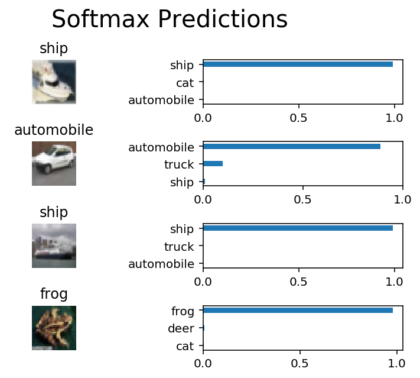

# Image Classification
In this project, you'll classify images from the [CIFAR-10 dataset](https://www.cs.toronto.edu/~kriz/cifar.html).  The dataset consists of airplanes, dogs, cats, and other objects. You'll preprocess the images, then train a convolutional neural network on all the samples. The images need to be normalized and the labels need to be one-hot encoded.  You'll get to apply what you learned and build a convolutional, max pooling, dropout, and fully connected layers.  At the end, you'll get to see your neural network's predictions on the sample images.
## Get the Data
Run the following cell to download the [CIFAR-10 dataset for python](https://www.cs.toronto.edu/~kriz/cifar-10-python.tar.gz).


```python
"""
DON'T MODIFY ANYTHING IN THIS CELL THAT IS BELOW THIS LINE
"""
from urllib.request import urlretrieve
from os.path import isfile, isdir
from tqdm import tqdm
import problem_unittests as tests
import tarfile

cifar10_dataset_folder_path = 'cifar-10-batches-py'

class DLProgress(tqdm):
    last_block = 0

    def hook(self, block_num=1, block_size=1, total_size=None):
        self.total = total_size
        self.update((block_num - self.last_block) * block_size)
        self.last_block = block_num

if not isfile('cifar-10-python.tar.gz'):
    with DLProgress(unit='B', unit_scale=True, miniters=1, desc='CIFAR-10 Dataset') as pbar:
        urlretrieve(
            'https://www.cs.toronto.edu/~kriz/cifar-10-python.tar.gz',
            'cifar-10-python.tar.gz',
            pbar.hook)

if not isdir(cifar10_dataset_folder_path):
    with tarfile.open('cifar-10-python.tar.gz') as tar:
        tar.extractall()
        tar.close()


tests.test_folder_path(cifar10_dataset_folder_path)
```

    CIFAR-10 Dataset: 171MB [00:34, 4.94MB/s]                              


    All files found!


## Explore the Data
The dataset is broken into batches to prevent your machine from running out of memory.  The CIFAR-10 dataset consists of 5 batches, named `data_batch_1`, `data_batch_2`, etc.. Each batch contains the labels and images that are one of the following:
* airplane
* automobile
* bird
* cat
* deer
* dog
* frog
* horse
* ship
* truck

Understanding a dataset is part of making predictions on the data.  Play around with the code cell below by changing the `batch_id` and `sample_id`. The `batch_id` is the id for a batch (1-5). The `sample_id` is the id for a image and label pair in the batch.

Ask yourself "What are all possible labels?", "What is the range of values for the image data?", "Are the labels in order or random?".  Answers to questions like these will help you preprocess the data and end up with better predictions.


```python
%matplotlib inline
%config InlineBackend.figure_format = 'retina'

import helper
import numpy as np

# Explore the dataset
batch_id = 1
sample_id = 5
helper.display_stats(cifar10_dataset_folder_path, batch_id, sample_id)
```

    
    Stats of batch 1:
    Samples: 10000
    Label Counts: {0: 1005, 1: 974, 2: 1032, 3: 1016, 4: 999, 5: 937, 6: 1030, 7: 1001, 8: 1025, 9: 981}
    First 20 Labels: [6, 9, 9, 4, 1, 1, 2, 7, 8, 3, 4, 7, 7, 2, 9, 9, 9, 3, 2, 6]
    
    Example of Image 5:
    Image - Min Value: 0 Max Value: 252
    Image - Shape: (32, 32, 3)
    Label - Label Id: 1 Name: automobile


## Implement Preprocess Functions
### Normalize
In the cell below, implement the `normalize` function to take in image data, `x`, and return it as a normalized Numpy array. The values should be in the range of 0 to 1, inclusive.  The return object should be the same shape as `x`.


```python
def normalize(x):
    """
    Normalize a list of sample image data in the range of 0 to 1
    : x: List of image data.  The image shape is (32, 32, 3)
    : return: Numpy array of normalize data
    """
    # TODO: Implement Function
    return x/255.0 # will keep the shape and normalize the range of color 0..255 for each channel R,G,B


"""
DON'T MODIFY ANYTHING IN THIS CELL THAT IS BELOW THIS LINE
"""
tests.test_normalize(normalize)
```

    Tests Passed


### One-hot encode
Just like the previous code cell, you'll be implementing a function for preprocessing.  This time, you'll implement the `one_hot_encode` function. The input, `x`, are a list of labels.  Implement the function to return the list of labels as One-Hot encoded Numpy array.  The possible values for labels are 0 to 9. The one-hot encoding function should return the same encoding for each value between each call to `one_hot_encode`.  Make sure to save the map of encodings outside the function.

Hint: Don't reinvent the wheel.


```python
from sklearn import preprocessing #suing sklearn for one hot encoding

# Using the Label Binarizer
lb = preprocessing.LabelBinarizer()
first_time_one_hot_encode = True

def one_hot_encode(x):
    """
    One hot encode a list of sample labels. Return a one-hot encoded vector for each label.
    : x: List of sample Labels
    : return: Numpy array of one-hot encoded labels
    """
    # TODO: Implement Function
    # fit to the data
    global first_time_one_hot_encode
    if first_time_one_hot_encode:
        lb.fit(x)
        first_time_one_hot_encode=False
    # get the one-hot encoding for the given data
    return lb.transform(x)


"""
DON'T MODIFY ANYTHING IN THIS CELL THAT IS BELOW THIS LINE
"""
tests.test_one_hot_encode(one_hot_encode)
```

    Tests Passed


### Randomize Data
As you saw from exploring the data above, the order of the samples are randomized.  It doesn't hurt to randomize it again, but you don't need to for this dataset.

## Preprocess all the data and save it
Running the code cell below will preprocess all the CIFAR-10 data and save it to file. The code below also uses 10% of the training data for validation.


```python
"""
DON'T MODIFY ANYTHING IN THIS CELL
"""
# Preprocess Training, Validation, and Testing Data
helper.preprocess_and_save_data(cifar10_dataset_folder_path, normalize, one_hot_encode)
```

# Check Point
This is your first checkpoint.  If you ever decide to come back to this notebook or have to restart the notebook, you can start from here.  The preprocessed data has been saved to disk.


```python
"""
DON'T MODIFY ANYTHING IN THIS CELL
"""
import pickle
import problem_unittests as tests
import helper

# Load the Preprocessed Validation data
valid_features, valid_labels = pickle.load(open('preprocess_validation.p', mode='rb'))
```

## Build the network
For the neural network, you'll build each layer into a function.  Most of the code you've seen has been outside of functions. To test your code more thoroughly, we require that you put each layer in a function.  This allows us to give you better feedback and test for simple mistakes using our unittests before you submit your project.

>**Note:** If you're finding it hard to dedicate enough time for this course each week, we've provided a small shortcut to this part of the project. In the next couple of problems, you'll have the option to use classes from the [TensorFlow Layers](https://www.tensorflow.org/api_docs/python/tf/layers) or [TensorFlow Layers (contrib)](https://www.tensorflow.org/api_guides/python/contrib.layers) packages to build each layer, except the layers you build in the "Convolutional and Max Pooling Layer" section.  TF Layers is similar to Keras's and TFLearn's abstraction to layers, so it's easy to pickup.

>However, if you would like to get the most out of this course, try to solve all the problems _without_ using anything from the TF Layers packages. You **can** still use classes from other packages that happen to have the same name as ones you find in TF Layers! For example, instead of using the TF Layers version of the `conv2d` class, [tf.layers.conv2d](https://www.tensorflow.org/api_docs/python/tf/layers/conv2d), you would want to use the TF Neural Network version of `conv2d`, [tf.nn.conv2d](https://www.tensorflow.org/api_docs/python/tf/nn/conv2d). 

Let's begin!

### Input
The neural network needs to read the image data, one-hot encoded labels, and dropout keep probability. Implement the following functions
* Implement `neural_net_image_input`
 * Return a [TF Placeholder](https://www.tensorflow.org/api_docs/python/tf/placeholder)
 * Set the shape using `image_shape` with batch size set to `None`.
 * Name the TensorFlow placeholder "x" using the TensorFlow `name` parameter in the [TF Placeholder](https://www.tensorflow.org/api_docs/python/tf/placeholder).
* Implement `neural_net_label_input`
 * Return a [TF Placeholder](https://www.tensorflow.org/api_docs/python/tf/placeholder)
 * Set the shape using `n_classes` with batch size set to `None`.
 * Name the TensorFlow placeholder "y" using the TensorFlow `name` parameter in the [TF Placeholder](https://www.tensorflow.org/api_docs/python/tf/placeholder).
* Implement `neural_net_keep_prob_input`
 * Return a [TF Placeholder](https://www.tensorflow.org/api_docs/python/tf/placeholder) for dropout keep probability.
 * Name the TensorFlow placeholder "keep_prob" using the TensorFlow `name` parameter in the [TF Placeholder](https://www.tensorflow.org/api_docs/python/tf/placeholder).

These names will be used at the end of the project to load your saved model.

Note: `None` for shapes in TensorFlow allow for a dynamic size.


```python
import tensorflow as tf

def neural_net_image_input(image_shape):
    """
    Return a Tensor for a bach of image input
    : image_shape: Shape of the images
    : return: Tensor for image input.
    """
    # TODO: Implement Function
    x = tf.placeholder(tf.float32,[None,image_shape[0],image_shape[1],image_shape[2]],name="x")
    return x


def neural_net_label_input(n_classes):
    """
    Return a Tensor for a batch of label input
    : n_classes: Number of classes
    : return: Tensor for label input.
    """
    # TODO: Implement Function
    y=tf.placeholder(tf.float32,[None,n_classes],name="y")
    return y


def neural_net_keep_prob_input():
    """
    Return a Tensor for keep probability
    : return: Tensor for keep probability.
    """
    # TODO: Implement Function
    keep_prob=tf.placeholder(tf.float32,name="keep_prob")
    return keep_prob


"""
DON'T MODIFY ANYTHING IN THIS CELL THAT IS BELOW THIS LINE
"""
tf.reset_default_graph()
tests.test_nn_image_inputs(neural_net_image_input)
tests.test_nn_label_inputs(neural_net_label_input)
tests.test_nn_keep_prob_inputs(neural_net_keep_prob_input)
```

    Image Input Tests Passed.
    Label Input Tests Passed.
    Keep Prob Tests Passed.


### Convolution and Max Pooling Layer
Convolution layers have a lot of success with images. For this code cell, you should implement the function `conv2d_maxpool` to apply convolution then max pooling:
* Create the weight and bias using `conv_ksize`, `conv_num_outputs` and the shape of `x_tensor`.
* Apply a convolution to `x_tensor` using weight and `conv_strides`.
 * We recommend you use same padding, but you're welcome to use any padding.
* Add bias
* Add a nonlinear activation to the convolution.
* Apply Max Pooling using `pool_ksize` and `pool_strides`.
 * We recommend you use same padding, but you're welcome to use any padding.

**Note:** You **can't** use [TensorFlow Layers](https://www.tensorflow.org/api_docs/python/tf/layers) or [TensorFlow Layers (contrib)](https://www.tensorflow.org/api_guides/python/contrib.layers) for **this** layer, but you can still use TensorFlow's [Neural Network](https://www.tensorflow.org/api_docs/python/tf/nn) package. You may still use the shortcut option for all the **other** layers.


```python
def conv2d_maxpool(x_tensor, conv_num_outputs, conv_ksize, conv_strides, pool_ksize, pool_strides):
    """
    Apply convolution then max pooling to x_tensor
    :param x_tensor: TensorFlow Tensor
    :param conv_num_outputs: Number of outputs for the convolutional layer
    :param conv_ksize: kernal size 2-D Tuple for the convolutional layer
    :param conv_strides: Stride 2-D Tuple for convolution
    :param pool_ksize: kernal size 2-D Tuple for pool
    :param pool_strides: Stride 2-D Tuple for pool
    : return: A tensor that represents convolution and max pooling of x_tensor
    """
    # TODO: Implement Function
    # Creating weights an biases
    w = tf.Variable(tf.truncated_normal([conv_ksize[0],conv_ksize[1],
                                         int(x_tensor.get_shape().as_list()[3]),
                                         conv_num_outputs],stddev=float(1.0/conv_num_outputs)))
    b = tf.Variable(tf.zeros(conv_num_outputs))
    # convolution
    conv = tf.nn.conv2d(x_tensor,w,strides=[1,conv_strides[0],conv_strides[1],1],padding='SAME')
    conv = tf.nn.relu(tf.nn.bias_add(conv,b))#usning relu in conv layer
    # max pooling
    pool = tf.nn.max_pool(conv,
                          ksize=[1,pool_ksize[0],pool_ksize[1],1],
                          strides=[1,pool_strides[0],pool_strides[1],1],
                          padding='SAME')
    return pool


"""
DON'T MODIFY ANYTHING IN THIS CELL THAT IS BELOW THIS LINE
"""
tests.test_con_pool(conv2d_maxpool)
```

    Tests Passed


### Flatten Layer
Implement the `flatten` function to change the dimension of `x_tensor` from a 4-D tensor to a 2-D tensor.  The output should be the shape (*Batch Size*, *Flattened Image Size*). Shortcut option: you can use classes from the [TensorFlow Layers](https://www.tensorflow.org/api_docs/python/tf/layers) or [TensorFlow Layers (contrib)](https://www.tensorflow.org/api_guides/python/contrib.layers) packages for this layer. For more of a challenge, only use other TensorFlow packages.


```python
def flatten(x_tensor):
    """
    Flatten x_tensor to (Batch Size, Flattened Image Size)
    : x_tensor: A tensor of size (Batch Size, ...), where ... are the image dimensions.
    : return: A tensor of size (Batch Size, Flattened Image Size).
    """
    # TODO: Implement Function
    b_size,x,y,z = x_tensor.get_shape().as_list()
    if(b_size is None):
        b_size= -1
    return tf.reshape(x_tensor,[b_size,x*y*z])


"""
DON'T MODIFY ANYTHING IN THIS CELL THAT IS BELOW THIS LINE
"""
tests.test_flatten(flatten)
```

    Tests Passed


### Fully-Connected Layer
Implement the `fully_conn` function to apply a fully connected layer to `x_tensor` with the shape (*Batch Size*, *num_outputs*). Shortcut option: you can use classes from the [TensorFlow Layers](https://www.tensorflow.org/api_docs/python/tf/layers) or [TensorFlow Layers (contrib)](https://www.tensorflow.org/api_guides/python/contrib.layers) packages for this layer. For more of a challenge, only use other TensorFlow packages.


```python
def fully_conn(x_tensor, num_outputs):
    """
    Apply a fully connected layer to x_tensor using weight and bias
    : x_tensor: A 2-D tensor where the first dimension is batch size.
    : num_outputs: The number of output that the new tensor should be.
    : return: A 2-D tensor where the second dimension is num_outputs.
    """
    # TODO: Implement Function
    # Creating weights an biases
    w = tf.Variable(tf.truncated_normal([x_tensor.get_shape().as_list()[1],num_outputs],stddev=float(1.0/num_outputs)))
    b = tf.Variable(tf.zeros(num_outputs))
    # Computing layer
    conn = tf.add(tf.matmul(x_tensor,w),b)
    conn = tf.nn.relu(conn)
    return conn


"""
DON'T MODIFY ANYTHING IN THIS CELL THAT IS BELOW THIS LINE
"""
tests.test_fully_conn(fully_conn)
```

    Tests Passed


### Output Layer
Implement the `output` function to apply a fully connected layer to `x_tensor` with the shape (*Batch Size*, *num_outputs*). Shortcut option: you can use classes from the [TensorFlow Layers](https://www.tensorflow.org/api_docs/python/tf/layers) or [TensorFlow Layers (contrib)](https://www.tensorflow.org/api_guides/python/contrib.layers) packages for this layer. For more of a challenge, only use other TensorFlow packages.

**Note:** Activation, softmax, or cross entropy should **not** be applied to this.


```python
def output(x_tensor, num_outputs):
    """
    Apply a output layer to x_tensor using weight and bias
    : x_tensor: A 2-D tensor where the first dimension is batch size.
    : num_outputs: The number of output that the new tensor should be.
    : return: A 2-D tensor where the second dimension is num_outputs.
    """
    # TODO: Implement Function
    # Creating weights an biases
    w = tf.Variable(tf.truncated_normal([x_tensor.get_shape().as_list()[1],num_outputs],stddev=float(1.0/num_outputs)))
    b = tf.Variable(tf.zeros(num_outputs))
    # Computing layer
    out = tf.add(tf.matmul(x_tensor,w),b)
    return out


"""
DON'T MODIFY ANYTHING IN THIS CELL THAT IS BELOW THIS LINE
"""
tests.test_output(output)
```

    Tests Passed


### Create Convolutional Model
Implement the function `conv_net` to create a convolutional neural network model. The function takes in a batch of images, `x`, and outputs logits.  Use the layers you created above to create this model:

* Apply 1, 2, or 3 Convolution and Max Pool layers
* Apply a Flatten Layer
* Apply 1, 2, or 3 Fully Connected Layers
* Apply an Output Layer
* Return the output
* Apply [TensorFlow's Dropout](https://www.tensorflow.org/api_docs/python/tf/nn/dropout) to one or more layers in the model using `keep_prob`. 


```python
def conv_net(x, keep_prob):
    """
    Create a convolutional neural network model
    : x: Placeholder tensor that holds image data.
    : keep_prob: Placeholder tensor that hold dropout keep probability.
    : return: Tensor that represents logits
    """
    # TODO: Apply 1, 2, or 3 Convolution and Max Pool layers
    #    Play around with different number of outputs, kernel size and stride
    # Function Definition from Above:
    #    conv2d_maxpool(x_tensor, conv_num_outputs, conv_ksize, conv_strides, pool_ksize, pool_strides)
    conv1 = conv2d_maxpool(x_tensor=x, 
                           conv_num_outputs=8, 
                           conv_ksize=(2,2), 
                           conv_strides=(1,1), 
                           pool_ksize=(2,2), 
                           pool_strides=(1,1))
    conv2 = conv2d_maxpool(x_tensor=conv1, 
                           conv_num_outputs=16, 
                           conv_ksize=(3,3), 
                           conv_strides=(1,1), 
                           pool_ksize=(2,2), 
                           pool_strides=(2,2))
    conv3 = conv2d_maxpool(x_tensor=conv2, 
                           conv_num_outputs=32, 
                           conv_ksize=(2,2), 
                           conv_strides=(1,1), 
                           pool_ksize=(2,2), 
                           pool_strides=(2,2))
    

    # TODO: Apply a Flatten Layer
    # Function Definition from Above:
    #   flatten(x_tensor)
    flat = flatten(x_tensor=conv3)
    

    # TODO: Apply 1, 2, or 3 Fully Connected Layers
    #    Play around with different number of outputs
    # Function Definition from Above:
    #   fully_conn(x_tensor, num_outputs)
    #conn1 = fully_conn(x_tensor=flat, num_outputs=512)
    #conn1 = tf.nn.dropout(conn1, keep_prob)
    conn2 = fully_conn(x_tensor=flat, num_outputs=256)
    conn2 = tf.nn.dropout(conn2, keep_prob)
    conn3 = fully_conn(x_tensor=conn2, num_outputs=128)
    conn3 = tf.nn.dropout(conn3, keep_prob)
    
    
    # TODO: Apply an Output Layer
    #    Set this to the number of classes
    # Function Definition from Above:
    #   output(x_tensor, num_outputs)
    
    out =  output(x_tensor=conn3, num_outputs=10)
    # TODO: return output
    return out


"""
DON'T MODIFY ANYTHING IN THIS CELL THAT IS BELOW THIS LINE
"""

##############################
## Build the Neural Network ##
##############################

# Remove previous weights, bias, inputs, etc..
tf.reset_default_graph()

# Inputs
x = neural_net_image_input((32, 32, 3))
y = neural_net_label_input(10)
keep_prob = neural_net_keep_prob_input()

# Model
logits = conv_net(x, keep_prob)

# Name logits Tensor, so that is can be loaded from disk after training
logits = tf.identity(logits, name='logits')

# Loss and Optimizer
cost = tf.reduce_mean(tf.nn.softmax_cross_entropy_with_logits(logits=logits, labels=y))
optimizer = tf.train.AdamOptimizer().minimize(cost)

# Accuracy
correct_pred = tf.equal(tf.argmax(logits, 1), tf.argmax(y, 1))
accuracy = tf.reduce_mean(tf.cast(correct_pred, tf.float32), name='accuracy')

tests.test_conv_net(conv_net)
```

    Neural Network Built!


## Train the Neural Network
### Single Optimization
Implement the function `train_neural_network` to do a single optimization.  The optimization should use `optimizer` to optimize in `session` with a `feed_dict` of the following:
* `x` for image input
* `y` for labels
* `keep_prob` for keep probability for dropout

This function will be called for each batch, so `tf.global_variables_initializer()` has already been called.

Note: Nothing needs to be returned. This function is only optimizing the neural network.


```python
def train_neural_network(session, optimizer, keep_probability, feature_batch, label_batch):
    """
    Optimize the session on a batch of images and labels
    : session: Current TensorFlow session
    : optimizer: TensorFlow optimizer function
    : keep_probability: keep probability
    : feature_batch: Batch of Numpy image data
    : label_batch: Batch of Numpy label data
    """
    # TODO: Implement Function
    session.run(optimizer,feed_dict={x:feature_batch,y:label_batch, keep_prob:keep_probability})


"""
DON'T MODIFY ANYTHING IN THIS CELL THAT IS BELOW THIS LINE
"""
tests.test_train_nn(train_neural_network)
```

    Tests Passed


### Show Stats
Implement the function `print_stats` to print loss and validation accuracy.  Use the global variables `valid_features` and `valid_labels` to calculate validation accuracy.  Use a keep probability of `1.0` to calculate the loss and validation accuracy.


```python
def print_stats(session, feature_batch, label_batch, cost, accuracy):
    """
    Print information about loss and validation accuracy
    : session: Current TensorFlow session
    : feature_batch: Batch of Numpy image data
    : label_batch: Batch of Numpy label data
    : cost: TensorFlow cost function
    : accuracy: TensorFlow accuracy function
    """
    # TODO: Implement Function
    global valid_features
    global valid_labels
    a = sess.run(accuracy, feed_dict={
        x: valid_features,
        y: valid_labels,
        keep_prob: 1.})
    l = sess.run(cost, feed_dict={x: feature_batch, 
                                  y: label_batch, 
                                  keep_prob: 1.})
    print('loss', l, 'accuracy', a)
```

### Hyperparameters
Tune the following parameters:
* Set `epochs` to the number of iterations until the network stops learning or start overfitting
* Set `batch_size` to the highest number that your machine has memory for.  Most people set them to common sizes of memory:
 * 64
 * 128
 * 256
 * ...
* Set `keep_probability` to the probability of keeping a node using dropout


```python
# TODO: Tune Parameters
epochs = 100
batch_size = 4048
keep_probability = 0.7
```

### Train on a Single CIFAR-10 Batch
Instead of training the neural network on all the CIFAR-10 batches of data, let's use a single batch. This should save time while you iterate on the model to get a better accuracy.  Once the final validation accuracy is 50% or greater, run the model on all the data in the next section.


```python
"""
DON'T MODIFY ANYTHING IN THIS CELL
"""
print('Checking the Training on a Single Batch...')
with tf.Session() as sess:
    # Initializing the variables
    sess.run(tf.global_variables_initializer())
    
    # Training cycle
    for epoch in range(epochs):
        batch_i = 1
        for batch_features, batch_labels in helper.load_preprocess_training_batch(batch_i, batch_size):
            train_neural_network(sess, optimizer, keep_probability, batch_features, batch_labels)
        print('Epoch {:>2}, CIFAR-10 Batch {}:  '.format(epoch + 1, batch_i), end='')
        print_stats(sess, batch_features, batch_labels, cost, accuracy)
```

    Checking the Training on a Single Batch...
    Epoch  1, CIFAR-10 Batch 1:  loss 2.30168 accuracy 0.171
    Epoch  2, CIFAR-10 Batch 1:  loss 2.29232 accuracy 0.1802
    Epoch  3, CIFAR-10 Batch 1:  loss 2.24856 accuracy 0.1838
    Epoch  4, CIFAR-10 Batch 1:  loss 2.16418 accuracy 0.175
    Epoch  5, CIFAR-10 Batch 1:  loss 2.12503 accuracy 0.216
    Epoch  6, CIFAR-10 Batch 1:  loss 2.09459 accuracy 0.2264
    Epoch  7, CIFAR-10 Batch 1:  loss 2.085 accuracy 0.2316
    Epoch  8, CIFAR-10 Batch 1:  loss 2.07149 accuracy 0.224
    Epoch  9, CIFAR-10 Batch 1:  loss 2.05585 accuracy 0.2384
    Epoch 10, CIFAR-10 Batch 1:  loss 2.04001 accuracy 0.2598
    Epoch 11, CIFAR-10 Batch 1:  loss 2.02678 accuracy 0.2648
    Epoch 12, CIFAR-10 Batch 1:  loss 2.01 accuracy 0.2742
    Epoch 13, CIFAR-10 Batch 1:  loss 1.98713 accuracy 0.2788
    Epoch 14, CIFAR-10 Batch 1:  loss 1.96261 accuracy 0.2848
    Epoch 15, CIFAR-10 Batch 1:  loss 1.93439 accuracy 0.293
    Epoch 16, CIFAR-10 Batch 1:  loss 1.9067 accuracy 0.292
    Epoch 17, CIFAR-10 Batch 1:  loss 1.87991 accuracy 0.309
    Epoch 18, CIFAR-10 Batch 1:  loss 1.8411 accuracy 0.3162
    Epoch 19, CIFAR-10 Batch 1:  loss 1.80997 accuracy 0.3332
    Epoch 20, CIFAR-10 Batch 1:  loss 1.77942 accuracy 0.342
    Epoch 21, CIFAR-10 Batch 1:  loss 1.74483 accuracy 0.3474
    Epoch 22, CIFAR-10 Batch 1:  loss 1.72042 accuracy 0.354
    Epoch 23, CIFAR-10 Batch 1:  loss 1.69211 accuracy 0.3576
    Epoch 24, CIFAR-10 Batch 1:  loss 1.67731 accuracy 0.3638
    Epoch 25, CIFAR-10 Batch 1:  loss 1.65013 accuracy 0.365
    Epoch 26, CIFAR-10 Batch 1:  loss 1.63803 accuracy 0.3696
    Epoch 27, CIFAR-10 Batch 1:  loss 1.62508 accuracy 0.3748
    Epoch 28, CIFAR-10 Batch 1:  loss 1.60998 accuracy 0.3802
    Epoch 29, CIFAR-10 Batch 1:  loss 1.59623 accuracy 0.3792
    Epoch 30, CIFAR-10 Batch 1:  loss 1.58175 accuracy 0.3852
    Epoch 31, CIFAR-10 Batch 1:  loss 1.56857 accuracy 0.394
    Epoch 32, CIFAR-10 Batch 1:  loss 1.55282 accuracy 0.3962
    Epoch 33, CIFAR-10 Batch 1:  loss 1.54372 accuracy 0.405
    Epoch 34, CIFAR-10 Batch 1:  loss 1.52673 accuracy 0.4104
    Epoch 35, CIFAR-10 Batch 1:  loss 1.51337 accuracy 0.4172
    Epoch 36, CIFAR-10 Batch 1:  loss 1.50152 accuracy 0.4188
    Epoch 37, CIFAR-10 Batch 1:  loss 1.48721 accuracy 0.4242
    Epoch 38, CIFAR-10 Batch 1:  loss 1.47702 accuracy 0.428
    Epoch 39, CIFAR-10 Batch 1:  loss 1.45712 accuracy 0.4294
    Epoch 40, CIFAR-10 Batch 1:  loss 1.44734 accuracy 0.4352
    Epoch 41, CIFAR-10 Batch 1:  loss 1.43865 accuracy 0.4352
    Epoch 42, CIFAR-10 Batch 1:  loss 1.42889 accuracy 0.4358
    Epoch 43, CIFAR-10 Batch 1:  loss 1.42472 accuracy 0.4382
    Epoch 44, CIFAR-10 Batch 1:  loss 1.40436 accuracy 0.4386
    Epoch 45, CIFAR-10 Batch 1:  loss 1.39161 accuracy 0.4404
    Epoch 46, CIFAR-10 Batch 1:  loss 1.37725 accuracy 0.4444
    Epoch 47, CIFAR-10 Batch 1:  loss 1.36393 accuracy 0.45
    Epoch 48, CIFAR-10 Batch 1:  loss 1.3592 accuracy 0.45
    Epoch 49, CIFAR-10 Batch 1:  loss 1.35421 accuracy 0.4506
    Epoch 50, CIFAR-10 Batch 1:  loss 1.33952 accuracy 0.4584
    Epoch 51, CIFAR-10 Batch 1:  loss 1.32387 accuracy 0.4574
    Epoch 52, CIFAR-10 Batch 1:  loss 1.31096 accuracy 0.463
    Epoch 53, CIFAR-10 Batch 1:  loss 1.3014 accuracy 0.4648
    Epoch 54, CIFAR-10 Batch 1:  loss 1.28954 accuracy 0.4642
    Epoch 55, CIFAR-10 Batch 1:  loss 1.28258 accuracy 0.4676
    Epoch 56, CIFAR-10 Batch 1:  loss 1.27176 accuracy 0.471
    Epoch 57, CIFAR-10 Batch 1:  loss 1.26182 accuracy 0.478
    Epoch 58, CIFAR-10 Batch 1:  loss 1.25385 accuracy 0.4808
    Epoch 59, CIFAR-10 Batch 1:  loss 1.23961 accuracy 0.4782
    Epoch 60, CIFAR-10 Batch 1:  loss 1.2439 accuracy 0.4776
    Epoch 61, CIFAR-10 Batch 1:  loss 1.25519 accuracy 0.4784
    Epoch 62, CIFAR-10 Batch 1:  loss 1.26396 accuracy 0.4812
    Epoch 63, CIFAR-10 Batch 1:  loss 1.23622 accuracy 0.4852
    Epoch 64, CIFAR-10 Batch 1:  loss 1.20941 accuracy 0.497
    Epoch 65, CIFAR-10 Batch 1:  loss 1.19163 accuracy 0.4938
    Epoch 66, CIFAR-10 Batch 1:  loss 1.17721 accuracy 0.4892
    Epoch 67, CIFAR-10 Batch 1:  loss 1.17399 accuracy 0.4972
    Epoch 68, CIFAR-10 Batch 1:  loss 1.15751 accuracy 0.4964
    Epoch 69, CIFAR-10 Batch 1:  loss 1.14862 accuracy 0.4966
    Epoch 70, CIFAR-10 Batch 1:  loss 1.1438 accuracy 0.5
    Epoch 71, CIFAR-10 Batch 1:  loss 1.13386 accuracy 0.5014
    Epoch 72, CIFAR-10 Batch 1:  loss 1.11797 accuracy 0.5036
    Epoch 73, CIFAR-10 Batch 1:  loss 1.11411 accuracy 0.5038
    Epoch 74, CIFAR-10 Batch 1:  loss 1.10447 accuracy 0.5068
    Epoch 75, CIFAR-10 Batch 1:  loss 1.0954 accuracy 0.508
    Epoch 76, CIFAR-10 Batch 1:  loss 1.08945 accuracy 0.5104
    Epoch 77, CIFAR-10 Batch 1:  loss 1.08264 accuracy 0.5144
    Epoch 78, CIFAR-10 Batch 1:  loss 1.08887 accuracy 0.5068
    Epoch 79, CIFAR-10 Batch 1:  loss 1.07148 accuracy 0.5156
    Epoch 80, CIFAR-10 Batch 1:  loss 1.05462 accuracy 0.518
    Epoch 81, CIFAR-10 Batch 1:  loss 1.05057 accuracy 0.5186
    Epoch 82, CIFAR-10 Batch 1:  loss 1.04196 accuracy 0.517
    Epoch 83, CIFAR-10 Batch 1:  loss 1.0248 accuracy 0.5202
    Epoch 84, CIFAR-10 Batch 1:  loss 1.01892 accuracy 0.5222
    Epoch 85, CIFAR-10 Batch 1:  loss 1.01879 accuracy 0.5146
    Epoch 86, CIFAR-10 Batch 1:  loss 1.00412 accuracy 0.521
    Epoch 87, CIFAR-10 Batch 1:  loss 0.995951 accuracy 0.5264
    Epoch 88, CIFAR-10 Batch 1:  loss 0.97962 accuracy 0.5258
    Epoch 89, CIFAR-10 Batch 1:  loss 0.975514 accuracy 0.5274
    Epoch 90, CIFAR-10 Batch 1:  loss 0.969321 accuracy 0.5238
    Epoch 91, CIFAR-10 Batch 1:  loss 0.95665 accuracy 0.5268
    Epoch 92, CIFAR-10 Batch 1:  loss 0.953649 accuracy 0.5314
    Epoch 93, CIFAR-10 Batch 1:  loss 0.960196 accuracy 0.526
    Epoch 94, CIFAR-10 Batch 1:  loss 0.936513 accuracy 0.5298
    Epoch 95, CIFAR-10 Batch 1:  loss 0.943895 accuracy 0.5324
    Epoch 96, CIFAR-10 Batch 1:  loss 0.915438 accuracy 0.5386
    Epoch 97, CIFAR-10 Batch 1:  loss 0.907726 accuracy 0.5328
    Epoch 98, CIFAR-10 Batch 1:  loss 0.912964 accuracy 0.5278
    Epoch 99, CIFAR-10 Batch 1:  loss 0.89505 accuracy 0.5382
    Epoch 100, CIFAR-10 Batch 1:  loss 0.882055 accuracy 0.5368


### Fully Train the Model
Now that you got a good accuracy with a single CIFAR-10 batch, try it with all five batches.


```python
"""
DON'T MODIFY ANYTHING IN THIS CELL
"""
save_model_path = './image_classification'

print('Training...')
with tf.Session() as sess:
    # Initializing the variables
    sess.run(tf.global_variables_initializer())
    
    # Training cycle
    for epoch in range(epochs):
        # Loop over all batches
        n_batches = 5
        for batch_i in range(1, n_batches + 1):
            for batch_features, batch_labels in helper.load_preprocess_training_batch(batch_i, batch_size):
                train_neural_network(sess, optimizer, keep_probability, batch_features, batch_labels)
            print('Epoch {:>2}, CIFAR-10 Batch {}:  '.format(epoch + 1, batch_i), end='')
            print_stats(sess, batch_features, batch_labels, cost, accuracy)
            
    # Save Model
    saver = tf.train.Saver()
    save_path = saver.save(sess, save_model_path)
```

    Training...
    Epoch  1, CIFAR-10 Batch 1:  loss 2.30227 accuracy 0.105
    Epoch  1, CIFAR-10 Batch 2:  loss 2.30163 accuracy 0.0998
    Epoch  1, CIFAR-10 Batch 3:  loss 2.2978 accuracy 0.1386
    Epoch  1, CIFAR-10 Batch 4:  loss 2.29022 accuracy 0.1436
    Epoch  1, CIFAR-10 Batch 5:  loss 2.2659 accuracy 0.1694
    Epoch  2, CIFAR-10 Batch 1:  loss 2.23127 accuracy 0.1834
    Epoch  2, CIFAR-10 Batch 2:  loss 2.19667 accuracy 0.1862
    Epoch  2, CIFAR-10 Batch 3:  loss 2.19122 accuracy 0.168
    Epoch  2, CIFAR-10 Batch 4:  loss 2.14422 accuracy 0.1812
    Epoch  2, CIFAR-10 Batch 5:  loss 2.12512 accuracy 0.244
    Epoch  3, CIFAR-10 Batch 1:  loss 2.09776 accuracy 0.2348
    Epoch  3, CIFAR-10 Batch 2:  loss 2.05333 accuracy 0.251
    Epoch  3, CIFAR-10 Batch 3:  loss 2.06825 accuracy 0.238
    Epoch  3, CIFAR-10 Batch 4:  loss 1.99122 accuracy 0.2424
    Epoch  3, CIFAR-10 Batch 5:  loss 1.99067 accuracy 0.2706
    Epoch  4, CIFAR-10 Batch 1:  loss 2.00929 accuracy 0.2704
    Epoch  4, CIFAR-10 Batch 2:  loss 1.96954 accuracy 0.28
    Epoch  4, CIFAR-10 Batch 3:  loss 1.95386 accuracy 0.2818
    Epoch  4, CIFAR-10 Batch 4:  loss 1.90034 accuracy 0.2864
    Epoch  4, CIFAR-10 Batch 5:  loss 1.90011 accuracy 0.2996
    Epoch  5, CIFAR-10 Batch 1:  loss 1.90335 accuracy 0.3058
    Epoch  5, CIFAR-10 Batch 2:  loss 1.85806 accuracy 0.299
    Epoch  5, CIFAR-10 Batch 3:  loss 1.85203 accuracy 0.307
    Epoch  5, CIFAR-10 Batch 4:  loss 1.82637 accuracy 0.3
    Epoch  5, CIFAR-10 Batch 5:  loss 1.83859 accuracy 0.317
    Epoch  6, CIFAR-10 Batch 1:  loss 1.83164 accuracy 0.3258
    Epoch  6, CIFAR-10 Batch 2:  loss 1.78544 accuracy 0.3422
    Epoch  6, CIFAR-10 Batch 3:  loss 1.77548 accuracy 0.3454
    Epoch  6, CIFAR-10 Batch 4:  loss 1.76629 accuracy 0.3368
    Epoch  6, CIFAR-10 Batch 5:  loss 1.79919 accuracy 0.3514
    Epoch  7, CIFAR-10 Batch 1:  loss 1.79316 accuracy 0.349
    Epoch  7, CIFAR-10 Batch 2:  loss 1.75543 accuracy 0.3638
    Epoch  7, CIFAR-10 Batch 3:  loss 1.733 accuracy 0.3584
    Epoch  7, CIFAR-10 Batch 4:  loss 1.70971 accuracy 0.3658
    Epoch  7, CIFAR-10 Batch 5:  loss 1.74179 accuracy 0.3686
    Epoch  8, CIFAR-10 Batch 1:  loss 1.73541 accuracy 0.3732
    Epoch  8, CIFAR-10 Batch 2:  loss 1.71246 accuracy 0.3714
    Epoch  8, CIFAR-10 Batch 3:  loss 1.68887 accuracy 0.376
    Epoch  8, CIFAR-10 Batch 4:  loss 1.67421 accuracy 0.3784
    Epoch  8, CIFAR-10 Batch 5:  loss 1.69998 accuracy 0.3836
    Epoch  9, CIFAR-10 Batch 1:  loss 1.69649 accuracy 0.381
    Epoch  9, CIFAR-10 Batch 2:  loss 1.67158 accuracy 0.3886
    Epoch  9, CIFAR-10 Batch 3:  loss 1.63577 accuracy 0.3892
    Epoch  9, CIFAR-10 Batch 4:  loss 1.62719 accuracy 0.3922
    Epoch  9, CIFAR-10 Batch 5:  loss 1.65456 accuracy 0.3964
    Epoch 10, CIFAR-10 Batch 1:  loss 1.65448 accuracy 0.393
    Epoch 10, CIFAR-10 Batch 2:  loss 1.63226 accuracy 0.4008
    Epoch 10, CIFAR-10 Batch 3:  loss 1.59309 accuracy 0.404
    Epoch 10, CIFAR-10 Batch 4:  loss 1.58654 accuracy 0.4028
    Epoch 10, CIFAR-10 Batch 5:  loss 1.61138 accuracy 0.4088
    Epoch 11, CIFAR-10 Batch 1:  loss 1.61497 accuracy 0.4064
    Epoch 11, CIFAR-10 Batch 2:  loss 1.59781 accuracy 0.417
    Epoch 11, CIFAR-10 Batch 3:  loss 1.55683 accuracy 0.421
    Epoch 11, CIFAR-10 Batch 4:  loss 1.55275 accuracy 0.412
    Epoch 11, CIFAR-10 Batch 5:  loss 1.5647 accuracy 0.425
    Epoch 12, CIFAR-10 Batch 1:  loss 1.57441 accuracy 0.414
    Epoch 12, CIFAR-10 Batch 2:  loss 1.56232 accuracy 0.4258
    Epoch 12, CIFAR-10 Batch 3:  loss 1.53273 accuracy 0.4266
    Epoch 12, CIFAR-10 Batch 4:  loss 1.51678 accuracy 0.423
    Epoch 12, CIFAR-10 Batch 5:  loss 1.53413 accuracy 0.4326
    Epoch 13, CIFAR-10 Batch 1:  loss 1.53847 accuracy 0.4224
    Epoch 13, CIFAR-10 Batch 2:  loss 1.53056 accuracy 0.4372
    Epoch 13, CIFAR-10 Batch 3:  loss 1.4906 accuracy 0.437
    Epoch 13, CIFAR-10 Batch 4:  loss 1.48595 accuracy 0.4312
    Epoch 13, CIFAR-10 Batch 5:  loss 1.49434 accuracy 0.4364
    Epoch 14, CIFAR-10 Batch 1:  loss 1.5077 accuracy 0.4312
    Epoch 14, CIFAR-10 Batch 2:  loss 1.49447 accuracy 0.4436
    Epoch 14, CIFAR-10 Batch 3:  loss 1.46417 accuracy 0.4442
    Epoch 14, CIFAR-10 Batch 4:  loss 1.45771 accuracy 0.4454
    Epoch 14, CIFAR-10 Batch 5:  loss 1.4613 accuracy 0.4482
    Epoch 15, CIFAR-10 Batch 1:  loss 1.47132 accuracy 0.4512
    Epoch 15, CIFAR-10 Batch 2:  loss 1.46011 accuracy 0.4502
    Epoch 15, CIFAR-10 Batch 3:  loss 1.43388 accuracy 0.4536
    Epoch 15, CIFAR-10 Batch 4:  loss 1.4343 accuracy 0.4474
    Epoch 15, CIFAR-10 Batch 5:  loss 1.43244 accuracy 0.456
    Epoch 16, CIFAR-10 Batch 1:  loss 1.44755 accuracy 0.461
    Epoch 16, CIFAR-10 Batch 2:  loss 1.4388 accuracy 0.467
    Epoch 16, CIFAR-10 Batch 3:  loss 1.41168 accuracy 0.4616
    Epoch 16, CIFAR-10 Batch 4:  loss 1.42321 accuracy 0.46
    Epoch 16, CIFAR-10 Batch 5:  loss 1.41401 accuracy 0.4686
    Epoch 17, CIFAR-10 Batch 1:  loss 1.44354 accuracy 0.4612
    Epoch 17, CIFAR-10 Batch 2:  loss 1.41971 accuracy 0.4708
    Epoch 17, CIFAR-10 Batch 3:  loss 1.38109 accuracy 0.4764
    Epoch 17, CIFAR-10 Batch 4:  loss 1.37783 accuracy 0.4746
    Epoch 17, CIFAR-10 Batch 5:  loss 1.38143 accuracy 0.4772
    Epoch 18, CIFAR-10 Batch 1:  loss 1.40418 accuracy 0.4732
    Epoch 18, CIFAR-10 Batch 2:  loss 1.39573 accuracy 0.475
    Epoch 18, CIFAR-10 Batch 3:  loss 1.36436 accuracy 0.479
    Epoch 18, CIFAR-10 Batch 4:  loss 1.35186 accuracy 0.4826
    Epoch 18, CIFAR-10 Batch 5:  loss 1.35792 accuracy 0.478
    Epoch 19, CIFAR-10 Batch 1:  loss 1.377 accuracy 0.4864
    Epoch 19, CIFAR-10 Batch 2:  loss 1.37043 accuracy 0.4842
    Epoch 19, CIFAR-10 Batch 3:  loss 1.35421 accuracy 0.4804
    Epoch 19, CIFAR-10 Batch 4:  loss 1.34389 accuracy 0.4828
    Epoch 19, CIFAR-10 Batch 5:  loss 1.35243 accuracy 0.485
    Epoch 20, CIFAR-10 Batch 1:  loss 1.37204 accuracy 0.4838
    Epoch 20, CIFAR-10 Batch 2:  loss 1.35282 accuracy 0.4844
    Epoch 20, CIFAR-10 Batch 3:  loss 1.32159 accuracy 0.4888
    Epoch 20, CIFAR-10 Batch 4:  loss 1.31567 accuracy 0.4934
    Epoch 20, CIFAR-10 Batch 5:  loss 1.31433 accuracy 0.4962
    Epoch 21, CIFAR-10 Batch 1:  loss 1.34397 accuracy 0.4902
    Epoch 21, CIFAR-10 Batch 2:  loss 1.32912 accuracy 0.5002
    Epoch 21, CIFAR-10 Batch 3:  loss 1.30288 accuracy 0.4944
    Epoch 21, CIFAR-10 Batch 4:  loss 1.29614 accuracy 0.4958
    Epoch 21, CIFAR-10 Batch 5:  loss 1.29777 accuracy 0.4984
    Epoch 22, CIFAR-10 Batch 1:  loss 1.31892 accuracy 0.497
    Epoch 22, CIFAR-10 Batch 2:  loss 1.3044 accuracy 0.5058
    Epoch 22, CIFAR-10 Batch 3:  loss 1.28343 accuracy 0.5044
    Epoch 22, CIFAR-10 Batch 4:  loss 1.27771 accuracy 0.5026
    Epoch 22, CIFAR-10 Batch 5:  loss 1.27524 accuracy 0.504
    Epoch 23, CIFAR-10 Batch 1:  loss 1.29841 accuracy 0.5048
    Epoch 23, CIFAR-10 Batch 2:  loss 1.29241 accuracy 0.5086
    Epoch 23, CIFAR-10 Batch 3:  loss 1.27038 accuracy 0.5038
    Epoch 23, CIFAR-10 Batch 4:  loss 1.2578 accuracy 0.5118
    Epoch 23, CIFAR-10 Batch 5:  loss 1.25026 accuracy 0.5104
    Epoch 24, CIFAR-10 Batch 1:  loss 1.27663 accuracy 0.5134
    Epoch 24, CIFAR-10 Batch 2:  loss 1.27384 accuracy 0.5148
    Epoch 24, CIFAR-10 Batch 3:  loss 1.25235 accuracy 0.5098
    Epoch 24, CIFAR-10 Batch 4:  loss 1.23873 accuracy 0.512
    Epoch 24, CIFAR-10 Batch 5:  loss 1.22888 accuracy 0.5172
    Epoch 25, CIFAR-10 Batch 1:  loss 1.26606 accuracy 0.5174
    Epoch 25, CIFAR-10 Batch 2:  loss 1.25396 accuracy 0.5248
    Epoch 25, CIFAR-10 Batch 3:  loss 1.22469 accuracy 0.5226
    Epoch 25, CIFAR-10 Batch 4:  loss 1.20558 accuracy 0.525
    Epoch 25, CIFAR-10 Batch 5:  loss 1.20763 accuracy 0.523
    Epoch 26, CIFAR-10 Batch 1:  loss 1.24297 accuracy 0.5284
    Epoch 26, CIFAR-10 Batch 2:  loss 1.22408 accuracy 0.5286
    Epoch 26, CIFAR-10 Batch 3:  loss 1.20436 accuracy 0.527
    Epoch 26, CIFAR-10 Batch 4:  loss 1.19892 accuracy 0.5252
    Epoch 26, CIFAR-10 Batch 5:  loss 1.19398 accuracy 0.5294
    Epoch 27, CIFAR-10 Batch 1:  loss 1.2315 accuracy 0.5324
    Epoch 27, CIFAR-10 Batch 2:  loss 1.21592 accuracy 0.5304
    Epoch 27, CIFAR-10 Batch 3:  loss 1.19392 accuracy 0.5302
    Epoch 27, CIFAR-10 Batch 4:  loss 1.17902 accuracy 0.53
    Epoch 27, CIFAR-10 Batch 5:  loss 1.1701 accuracy 0.5354
    Epoch 28, CIFAR-10 Batch 1:  loss 1.21634 accuracy 0.5312
    Epoch 28, CIFAR-10 Batch 2:  loss 1.19787 accuracy 0.5402
    Epoch 28, CIFAR-10 Batch 3:  loss 1.16457 accuracy 0.5416
    Epoch 28, CIFAR-10 Batch 4:  loss 1.15306 accuracy 0.5316
    Epoch 28, CIFAR-10 Batch 5:  loss 1.14764 accuracy 0.537
    Epoch 29, CIFAR-10 Batch 1:  loss 1.19289 accuracy 0.5356
    Epoch 29, CIFAR-10 Batch 2:  loss 1.17522 accuracy 0.544
    Epoch 29, CIFAR-10 Batch 3:  loss 1.14905 accuracy 0.544
    Epoch 29, CIFAR-10 Batch 4:  loss 1.13903 accuracy 0.538
    Epoch 29, CIFAR-10 Batch 5:  loss 1.14015 accuracy 0.5386
    Epoch 30, CIFAR-10 Batch 1:  loss 1.179 accuracy 0.546
    Epoch 30, CIFAR-10 Batch 2:  loss 1.16155 accuracy 0.5452
    Epoch 30, CIFAR-10 Batch 3:  loss 1.1325 accuracy 0.544
    Epoch 30, CIFAR-10 Batch 4:  loss 1.12274 accuracy 0.5428
    Epoch 30, CIFAR-10 Batch 5:  loss 1.11256 accuracy 0.5476
    Epoch 31, CIFAR-10 Batch 1:  loss 1.16121 accuracy 0.5468
    Epoch 31, CIFAR-10 Batch 2:  loss 1.1479 accuracy 0.5444
    Epoch 31, CIFAR-10 Batch 3:  loss 1.11466 accuracy 0.5474
    Epoch 31, CIFAR-10 Batch 4:  loss 1.10887 accuracy 0.5412
    Epoch 31, CIFAR-10 Batch 5:  loss 1.11059 accuracy 0.5436
    Epoch 32, CIFAR-10 Batch 1:  loss 1.14984 accuracy 0.5512
    Epoch 32, CIFAR-10 Batch 2:  loss 1.12805 accuracy 0.5532
    Epoch 32, CIFAR-10 Batch 3:  loss 1.09407 accuracy 0.5524
    Epoch 32, CIFAR-10 Batch 4:  loss 1.07988 accuracy 0.5516
    Epoch 32, CIFAR-10 Batch 5:  loss 1.07784 accuracy 0.5538
    Epoch 33, CIFAR-10 Batch 1:  loss 1.13149 accuracy 0.55
    Epoch 33, CIFAR-10 Batch 2:  loss 1.11019 accuracy 0.5576
    Epoch 33, CIFAR-10 Batch 3:  loss 1.07484 accuracy 0.5532
    Epoch 33, CIFAR-10 Batch 4:  loss 1.07073 accuracy 0.5484
    Epoch 33, CIFAR-10 Batch 5:  loss 1.08588 accuracy 0.5446
    Epoch 34, CIFAR-10 Batch 1:  loss 1.10751 accuracy 0.5624
    Epoch 34, CIFAR-10 Batch 2:  loss 1.10383 accuracy 0.5612
    Epoch 34, CIFAR-10 Batch 3:  loss 1.06501 accuracy 0.558
    Epoch 34, CIFAR-10 Batch 4:  loss 1.05805 accuracy 0.5516
    Epoch 34, CIFAR-10 Batch 5:  loss 1.0499 accuracy 0.5544
    Epoch 35, CIFAR-10 Batch 1:  loss 1.11193 accuracy 0.5512
    Epoch 35, CIFAR-10 Batch 2:  loss 1.09885 accuracy 0.5554
    Epoch 35, CIFAR-10 Batch 3:  loss 1.0458 accuracy 0.5608
    Epoch 35, CIFAR-10 Batch 4:  loss 1.04737 accuracy 0.5558
    Epoch 35, CIFAR-10 Batch 5:  loss 1.02872 accuracy 0.5596
    Epoch 36, CIFAR-10 Batch 1:  loss 1.09919 accuracy 0.5504
    Epoch 36, CIFAR-10 Batch 2:  loss 1.07613 accuracy 0.561
    Epoch 36, CIFAR-10 Batch 3:  loss 1.04876 accuracy 0.5596
    Epoch 36, CIFAR-10 Batch 4:  loss 1.03554 accuracy 0.5594
    Epoch 36, CIFAR-10 Batch 5:  loss 1.01312 accuracy 0.5642
    Epoch 37, CIFAR-10 Batch 1:  loss 1.07607 accuracy 0.5568
    Epoch 37, CIFAR-10 Batch 2:  loss 1.04788 accuracy 0.5674
    Epoch 37, CIFAR-10 Batch 3:  loss 1.01866 accuracy 0.567
    Epoch 37, CIFAR-10 Batch 4:  loss 1.00995 accuracy 0.5644
    Epoch 37, CIFAR-10 Batch 5:  loss 0.997698 accuracy 0.5664
    Epoch 38, CIFAR-10 Batch 1:  loss 1.06258 accuracy 0.5586
    Epoch 38, CIFAR-10 Batch 2:  loss 1.04569 accuracy 0.5596
    Epoch 38, CIFAR-10 Batch 3:  loss 1.02446 accuracy 0.5632
    Epoch 38, CIFAR-10 Batch 4:  loss 1.00596 accuracy 0.5644
    Epoch 38, CIFAR-10 Batch 5:  loss 0.995669 accuracy 0.5636
    Epoch 39, CIFAR-10 Batch 1:  loss 1.05698 accuracy 0.5608
    Epoch 39, CIFAR-10 Batch 2:  loss 1.02262 accuracy 0.5684
    Epoch 39, CIFAR-10 Batch 3:  loss 1.01111 accuracy 0.56
    Epoch 39, CIFAR-10 Batch 4:  loss 1.00531 accuracy 0.5592
    Epoch 39, CIFAR-10 Batch 5:  loss 0.978296 accuracy 0.5628
    Epoch 40, CIFAR-10 Batch 1:  loss 1.03143 accuracy 0.576
    Epoch 40, CIFAR-10 Batch 2:  loss 1.00718 accuracy 0.5766
    Epoch 40, CIFAR-10 Batch 3:  loss 0.976101 accuracy 0.5784
    Epoch 40, CIFAR-10 Batch 4:  loss 0.971614 accuracy 0.5668
    Epoch 40, CIFAR-10 Batch 5:  loss 0.937145 accuracy 0.5754
    Epoch 41, CIFAR-10 Batch 1:  loss 1.01218 accuracy 0.5684
    Epoch 41, CIFAR-10 Batch 2:  loss 0.997774 accuracy 0.5772
    Epoch 41, CIFAR-10 Batch 3:  loss 0.971759 accuracy 0.5732
    Epoch 41, CIFAR-10 Batch 4:  loss 0.962638 accuracy 0.5678
    Epoch 41, CIFAR-10 Batch 5:  loss 0.928554 accuracy 0.5764
    Epoch 42, CIFAR-10 Batch 1:  loss 0.991735 accuracy 0.5724
    Epoch 42, CIFAR-10 Batch 2:  loss 0.964083 accuracy 0.58
    Epoch 42, CIFAR-10 Batch 3:  loss 0.960741 accuracy 0.575
    Epoch 42, CIFAR-10 Batch 4:  loss 0.946815 accuracy 0.578
    Epoch 42, CIFAR-10 Batch 5:  loss 0.921815 accuracy 0.5792
    Epoch 43, CIFAR-10 Batch 1:  loss 0.974085 accuracy 0.5768
    Epoch 43, CIFAR-10 Batch 2:  loss 0.960512 accuracy 0.5734
    Epoch 43, CIFAR-10 Batch 3:  loss 0.932335 accuracy 0.5806
    Epoch 43, CIFAR-10 Batch 4:  loss 0.939072 accuracy 0.5792
    Epoch 43, CIFAR-10 Batch 5:  loss 0.907843 accuracy 0.5808
    Epoch 44, CIFAR-10 Batch 1:  loss 0.964085 accuracy 0.5756
    Epoch 44, CIFAR-10 Batch 2:  loss 0.934876 accuracy 0.582
    Epoch 44, CIFAR-10 Batch 3:  loss 0.919408 accuracy 0.5848
    Epoch 44, CIFAR-10 Batch 4:  loss 0.918728 accuracy 0.5834
    Epoch 44, CIFAR-10 Batch 5:  loss 0.897153 accuracy 0.5824
    Epoch 45, CIFAR-10 Batch 1:  loss 0.950835 accuracy 0.5784
    Epoch 45, CIFAR-10 Batch 2:  loss 0.925524 accuracy 0.5836
    Epoch 45, CIFAR-10 Batch 3:  loss 0.901501 accuracy 0.585
    Epoch 45, CIFAR-10 Batch 4:  loss 0.911172 accuracy 0.5808
    Epoch 45, CIFAR-10 Batch 5:  loss 0.871543 accuracy 0.5824
    Epoch 46, CIFAR-10 Batch 1:  loss 0.929675 accuracy 0.585
    Epoch 46, CIFAR-10 Batch 2:  loss 0.908553 accuracy 0.5884
    Epoch 46, CIFAR-10 Batch 3:  loss 0.88596 accuracy 0.5904
    Epoch 46, CIFAR-10 Batch 4:  loss 0.894314 accuracy 0.5878
    Epoch 46, CIFAR-10 Batch 5:  loss 0.860858 accuracy 0.5884
    Epoch 47, CIFAR-10 Batch 1:  loss 0.912576 accuracy 0.5864
    Epoch 47, CIFAR-10 Batch 2:  loss 0.899518 accuracy 0.5894
    Epoch 47, CIFAR-10 Batch 3:  loss 0.866248 accuracy 0.5912
    Epoch 47, CIFAR-10 Batch 4:  loss 0.887488 accuracy 0.5846
    Epoch 47, CIFAR-10 Batch 5:  loss 0.852313 accuracy 0.581
    Epoch 48, CIFAR-10 Batch 1:  loss 0.899708 accuracy 0.5902
    Epoch 48, CIFAR-10 Batch 2:  loss 0.885918 accuracy 0.5886
    Epoch 48, CIFAR-10 Batch 3:  loss 0.859336 accuracy 0.5862
    Epoch 48, CIFAR-10 Batch 4:  loss 0.889641 accuracy 0.5818
    Epoch 48, CIFAR-10 Batch 5:  loss 0.822907 accuracy 0.592
    Epoch 49, CIFAR-10 Batch 1:  loss 0.889796 accuracy 0.588
    Epoch 49, CIFAR-10 Batch 2:  loss 0.872804 accuracy 0.591
    Epoch 49, CIFAR-10 Batch 3:  loss 0.848609 accuracy 0.5876
    Epoch 49, CIFAR-10 Batch 4:  loss 0.858144 accuracy 0.5892
    Epoch 49, CIFAR-10 Batch 5:  loss 0.806385 accuracy 0.5956
    Epoch 50, CIFAR-10 Batch 1:  loss 0.883236 accuracy 0.5926
    Epoch 50, CIFAR-10 Batch 2:  loss 0.854406 accuracy 0.5954
    Epoch 50, CIFAR-10 Batch 3:  loss 0.838095 accuracy 0.5914
    Epoch 50, CIFAR-10 Batch 4:  loss 0.840831 accuracy 0.592
    Epoch 50, CIFAR-10 Batch 5:  loss 0.796869 accuracy 0.5902
    Epoch 51, CIFAR-10 Batch 1:  loss 0.86802 accuracy 0.595
    Epoch 51, CIFAR-10 Batch 2:  loss 0.835192 accuracy 0.5944
    Epoch 51, CIFAR-10 Batch 3:  loss 0.822576 accuracy 0.5976
    Epoch 51, CIFAR-10 Batch 4:  loss 0.837563 accuracy 0.5984
    Epoch 51, CIFAR-10 Batch 5:  loss 0.788677 accuracy 0.5946
    Epoch 52, CIFAR-10 Batch 1:  loss 0.842823 accuracy 0.5954
    Epoch 52, CIFAR-10 Batch 2:  loss 0.832225 accuracy 0.5916
    Epoch 52, CIFAR-10 Batch 3:  loss 0.806346 accuracy 0.6032
    Epoch 52, CIFAR-10 Batch 4:  loss 0.802376 accuracy 0.6014
    Epoch 52, CIFAR-10 Batch 5:  loss 0.763766 accuracy 0.5994
    Epoch 53, CIFAR-10 Batch 1:  loss 0.83013 accuracy 0.5962
    Epoch 53, CIFAR-10 Batch 2:  loss 0.820861 accuracy 0.5902
    Epoch 53, CIFAR-10 Batch 3:  loss 0.78708 accuracy 0.6042
    Epoch 53, CIFAR-10 Batch 4:  loss 0.79531 accuracy 0.5988
    Epoch 53, CIFAR-10 Batch 5:  loss 0.749988 accuracy 0.6014
    Epoch 54, CIFAR-10 Batch 1:  loss 0.822424 accuracy 0.6006
    Epoch 54, CIFAR-10 Batch 2:  loss 0.803028 accuracy 0.5936
    Epoch 54, CIFAR-10 Batch 3:  loss 0.772664 accuracy 0.6036
    Epoch 54, CIFAR-10 Batch 4:  loss 0.78189 accuracy 0.6004
    Epoch 54, CIFAR-10 Batch 5:  loss 0.735887 accuracy 0.6054
    Epoch 55, CIFAR-10 Batch 1:  loss 0.798323 accuracy 0.6036
    Epoch 55, CIFAR-10 Batch 2:  loss 0.77486 accuracy 0.6038
    Epoch 55, CIFAR-10 Batch 3:  loss 0.753497 accuracy 0.6102
    Epoch 55, CIFAR-10 Batch 4:  loss 0.76396 accuracy 0.604
    Epoch 55, CIFAR-10 Batch 5:  loss 0.728089 accuracy 0.604
    Epoch 56, CIFAR-10 Batch 1:  loss 0.785959 accuracy 0.6058
    Epoch 56, CIFAR-10 Batch 2:  loss 0.758 accuracy 0.6094
    Epoch 56, CIFAR-10 Batch 3:  loss 0.74188 accuracy 0.613
    Epoch 56, CIFAR-10 Batch 4:  loss 0.746314 accuracy 0.6074
    Epoch 56, CIFAR-10 Batch 5:  loss 0.703536 accuracy 0.6054
    Epoch 57, CIFAR-10 Batch 1:  loss 0.771745 accuracy 0.6074
    Epoch 57, CIFAR-10 Batch 2:  loss 0.745328 accuracy 0.602
    Epoch 57, CIFAR-10 Batch 3:  loss 0.729409 accuracy 0.6084
    Epoch 57, CIFAR-10 Batch 4:  loss 0.746355 accuracy 0.6094
    Epoch 57, CIFAR-10 Batch 5:  loss 0.699266 accuracy 0.6048
    Epoch 58, CIFAR-10 Batch 1:  loss 0.758917 accuracy 0.6132
    Epoch 58, CIFAR-10 Batch 2:  loss 0.739007 accuracy 0.6148
    Epoch 58, CIFAR-10 Batch 3:  loss 0.719231 accuracy 0.6132
    Epoch 58, CIFAR-10 Batch 4:  loss 0.73001 accuracy 0.6162
    Epoch 58, CIFAR-10 Batch 5:  loss 0.678488 accuracy 0.6114
    Epoch 59, CIFAR-10 Batch 1:  loss 0.748123 accuracy 0.608
    Epoch 59, CIFAR-10 Batch 2:  loss 0.740488 accuracy 0.6034
    Epoch 59, CIFAR-10 Batch 3:  loss 0.709845 accuracy 0.6146
    Epoch 59, CIFAR-10 Batch 4:  loss 0.706711 accuracy 0.6176
    Epoch 59, CIFAR-10 Batch 5:  loss 0.670511 accuracy 0.6142
    Epoch 60, CIFAR-10 Batch 1:  loss 0.732448 accuracy 0.6118
    Epoch 60, CIFAR-10 Batch 2:  loss 0.702393 accuracy 0.614
    Epoch 60, CIFAR-10 Batch 3:  loss 0.704034 accuracy 0.6078
    Epoch 60, CIFAR-10 Batch 4:  loss 0.704347 accuracy 0.6164
    Epoch 60, CIFAR-10 Batch 5:  loss 0.655218 accuracy 0.6182
    Epoch 61, CIFAR-10 Batch 1:  loss 0.710269 accuracy 0.618
    Epoch 61, CIFAR-10 Batch 2:  loss 0.693579 accuracy 0.6058
    Epoch 61, CIFAR-10 Batch 3:  loss 0.690742 accuracy 0.609
    Epoch 61, CIFAR-10 Batch 4:  loss 0.710717 accuracy 0.6116
    Epoch 61, CIFAR-10 Batch 5:  loss 0.649168 accuracy 0.616
    Epoch 62, CIFAR-10 Batch 1:  loss 0.708533 accuracy 0.614
    Epoch 62, CIFAR-10 Batch 2:  loss 0.67497 accuracy 0.612
    Epoch 62, CIFAR-10 Batch 3:  loss 0.662902 accuracy 0.6152
    Epoch 62, CIFAR-10 Batch 4:  loss 0.70494 accuracy 0.6088
    Epoch 62, CIFAR-10 Batch 5:  loss 0.654175 accuracy 0.6102
    Epoch 63, CIFAR-10 Batch 1:  loss 0.702939 accuracy 0.6206
    Epoch 63, CIFAR-10 Batch 2:  loss 0.670025 accuracy 0.6166
    Epoch 63, CIFAR-10 Batch 3:  loss 0.661252 accuracy 0.6126
    Epoch 63, CIFAR-10 Batch 4:  loss 0.677098 accuracy 0.6148
    Epoch 63, CIFAR-10 Batch 5:  loss 0.632194 accuracy 0.616
    Epoch 64, CIFAR-10 Batch 1:  loss 0.688146 accuracy 0.6164
    Epoch 64, CIFAR-10 Batch 2:  loss 0.654009 accuracy 0.6166
    Epoch 64, CIFAR-10 Batch 3:  loss 0.642531 accuracy 0.618
    Epoch 64, CIFAR-10 Batch 4:  loss 0.670288 accuracy 0.6148
    Epoch 64, CIFAR-10 Batch 5:  loss 0.633107 accuracy 0.6092
    Epoch 65, CIFAR-10 Batch 1:  loss 0.685879 accuracy 0.6124
    Epoch 65, CIFAR-10 Batch 2:  loss 0.669287 accuracy 0.6114
    Epoch 65, CIFAR-10 Batch 3:  loss 0.633573 accuracy 0.617
    Epoch 65, CIFAR-10 Batch 4:  loss 0.63858 accuracy 0.6218
    Epoch 65, CIFAR-10 Batch 5:  loss 0.593607 accuracy 0.6238
    Epoch 66, CIFAR-10 Batch 1:  loss 0.669687 accuracy 0.6132
    Epoch 66, CIFAR-10 Batch 2:  loss 0.642521 accuracy 0.6146
    Epoch 66, CIFAR-10 Batch 3:  loss 0.624386 accuracy 0.6152
    Epoch 66, CIFAR-10 Batch 4:  loss 0.627822 accuracy 0.6238
    Epoch 66, CIFAR-10 Batch 5:  loss 0.587728 accuracy 0.6226
    Epoch 67, CIFAR-10 Batch 1:  loss 0.6464 accuracy 0.6222
    Epoch 67, CIFAR-10 Batch 2:  loss 0.636239 accuracy 0.6162
    Epoch 67, CIFAR-10 Batch 3:  loss 0.617065 accuracy 0.6222
    Epoch 67, CIFAR-10 Batch 4:  loss 0.620215 accuracy 0.6234
    Epoch 67, CIFAR-10 Batch 5:  loss 0.571494 accuracy 0.6206
    Epoch 68, CIFAR-10 Batch 1:  loss 0.63911 accuracy 0.622
    Epoch 68, CIFAR-10 Batch 2:  loss 0.616791 accuracy 0.6218
    Epoch 68, CIFAR-10 Batch 3:  loss 0.595853 accuracy 0.6212
    Epoch 68, CIFAR-10 Batch 4:  loss 0.611587 accuracy 0.6228
    Epoch 68, CIFAR-10 Batch 5:  loss 0.566063 accuracy 0.6216
    Epoch 69, CIFAR-10 Batch 1:  loss 0.624269 accuracy 0.6206
    Epoch 69, CIFAR-10 Batch 2:  loss 0.598884 accuracy 0.6192
    Epoch 69, CIFAR-10 Batch 3:  loss 0.584981 accuracy 0.621
    Epoch 69, CIFAR-10 Batch 4:  loss 0.60209 accuracy 0.6252
    Epoch 69, CIFAR-10 Batch 5:  loss 0.575997 accuracy 0.6182
    Epoch 70, CIFAR-10 Batch 1:  loss 0.624598 accuracy 0.6204
    Epoch 70, CIFAR-10 Batch 2:  loss 0.594544 accuracy 0.622
    Epoch 70, CIFAR-10 Batch 3:  loss 0.588398 accuracy 0.6172
    Epoch 70, CIFAR-10 Batch 4:  loss 0.584961 accuracy 0.6258
    Epoch 70, CIFAR-10 Batch 5:  loss 0.526894 accuracy 0.63
    Epoch 71, CIFAR-10 Batch 1:  loss 0.594008 accuracy 0.6322
    Epoch 71, CIFAR-10 Batch 2:  loss 0.575609 accuracy 0.6242
    Epoch 71, CIFAR-10 Batch 3:  loss 0.559486 accuracy 0.6284
    Epoch 71, CIFAR-10 Batch 4:  loss 0.567969 accuracy 0.6288
    Epoch 71, CIFAR-10 Batch 5:  loss 0.537872 accuracy 0.6218
    Epoch 72, CIFAR-10 Batch 1:  loss 0.580645 accuracy 0.6262
    Epoch 72, CIFAR-10 Batch 2:  loss 0.556265 accuracy 0.6298
    Epoch 72, CIFAR-10 Batch 3:  loss 0.550172 accuracy 0.6236
    Epoch 72, CIFAR-10 Batch 4:  loss 0.556623 accuracy 0.6276
    Epoch 72, CIFAR-10 Batch 5:  loss 0.515591 accuracy 0.6246
    Epoch 73, CIFAR-10 Batch 1:  loss 0.575304 accuracy 0.632
    Epoch 73, CIFAR-10 Batch 2:  loss 0.546303 accuracy 0.6286
    Epoch 73, CIFAR-10 Batch 3:  loss 0.541487 accuracy 0.625
    Epoch 73, CIFAR-10 Batch 4:  loss 0.544864 accuracy 0.6326
    Epoch 73, CIFAR-10 Batch 5:  loss 0.509618 accuracy 0.6254
    Epoch 74, CIFAR-10 Batch 1:  loss 0.578069 accuracy 0.6276
    Epoch 74, CIFAR-10 Batch 2:  loss 0.537177 accuracy 0.6286
    Epoch 74, CIFAR-10 Batch 3:  loss 0.533896 accuracy 0.6286
    Epoch 74, CIFAR-10 Batch 4:  loss 0.55336 accuracy 0.6284
    Epoch 74, CIFAR-10 Batch 5:  loss 0.516609 accuracy 0.6218
    Epoch 75, CIFAR-10 Batch 1:  loss 0.570841 accuracy 0.6284
    Epoch 75, CIFAR-10 Batch 2:  loss 0.543234 accuracy 0.6298
    Epoch 75, CIFAR-10 Batch 3:  loss 0.540426 accuracy 0.6262
    Epoch 75, CIFAR-10 Batch 4:  loss 0.536628 accuracy 0.6332
    Epoch 75, CIFAR-10 Batch 5:  loss 0.515076 accuracy 0.6204
    Epoch 76, CIFAR-10 Batch 1:  loss 0.556122 accuracy 0.6314
    Epoch 76, CIFAR-10 Batch 2:  loss 0.52001 accuracy 0.6284
    Epoch 76, CIFAR-10 Batch 3:  loss 0.525368 accuracy 0.6332
    Epoch 76, CIFAR-10 Batch 4:  loss 0.521106 accuracy 0.6334
    Epoch 76, CIFAR-10 Batch 5:  loss 0.520253 accuracy 0.615
    Epoch 77, CIFAR-10 Batch 1:  loss 0.580957 accuracy 0.6156
    Epoch 77, CIFAR-10 Batch 2:  loss 0.551054 accuracy 0.6092
    Epoch 77, CIFAR-10 Batch 3:  loss 0.551671 accuracy 0.627
    Epoch 77, CIFAR-10 Batch 4:  loss 0.534458 accuracy 0.623
    Epoch 77, CIFAR-10 Batch 5:  loss 0.488903 accuracy 0.6354
    Epoch 78, CIFAR-10 Batch 1:  loss 0.53709 accuracy 0.631
    Epoch 78, CIFAR-10 Batch 2:  loss 0.515617 accuracy 0.6274
    Epoch 78, CIFAR-10 Batch 3:  loss 0.544105 accuracy 0.6224
    Epoch 78, CIFAR-10 Batch 4:  loss 0.54754 accuracy 0.6222
    Epoch 78, CIFAR-10 Batch 5:  loss 0.49408 accuracy 0.6272
    Epoch 79, CIFAR-10 Batch 1:  loss 0.548008 accuracy 0.6258
    Epoch 79, CIFAR-10 Batch 2:  loss 0.510734 accuracy 0.6306
    Epoch 79, CIFAR-10 Batch 3:  loss 0.498555 accuracy 0.63
    Epoch 79, CIFAR-10 Batch 4:  loss 0.520125 accuracy 0.6266
    Epoch 79, CIFAR-10 Batch 5:  loss 0.471495 accuracy 0.6358
    Epoch 80, CIFAR-10 Batch 1:  loss 0.510129 accuracy 0.6342
    Epoch 80, CIFAR-10 Batch 2:  loss 0.489031 accuracy 0.6342
    Epoch 80, CIFAR-10 Batch 3:  loss 0.480147 accuracy 0.636
    Epoch 80, CIFAR-10 Batch 4:  loss 0.482736 accuracy 0.633
    Epoch 80, CIFAR-10 Batch 5:  loss 0.448838 accuracy 0.6342
    Epoch 81, CIFAR-10 Batch 1:  loss 0.495636 accuracy 0.637
    Epoch 81, CIFAR-10 Batch 2:  loss 0.46563 accuracy 0.6392
    Epoch 81, CIFAR-10 Batch 3:  loss 0.456109 accuracy 0.6384
    Epoch 81, CIFAR-10 Batch 4:  loss 0.46266 accuracy 0.6376
    Epoch 81, CIFAR-10 Batch 5:  loss 0.418192 accuracy 0.638
    Epoch 82, CIFAR-10 Batch 1:  loss 0.464879 accuracy 0.6386
    Epoch 82, CIFAR-10 Batch 2:  loss 0.460209 accuracy 0.6308
    Epoch 82, CIFAR-10 Batch 3:  loss 0.470064 accuracy 0.6394
    Epoch 82, CIFAR-10 Batch 4:  loss 0.476843 accuracy 0.6234
    Epoch 82, CIFAR-10 Batch 5:  loss 0.422066 accuracy 0.6366
    Epoch 83, CIFAR-10 Batch 1:  loss 0.467208 accuracy 0.6338
    Epoch 83, CIFAR-10 Batch 2:  loss 0.444177 accuracy 0.639
    Epoch 83, CIFAR-10 Batch 3:  loss 0.454955 accuracy 0.641
    Epoch 83, CIFAR-10 Batch 4:  loss 0.469153 accuracy 0.6244
    Epoch 83, CIFAR-10 Batch 5:  loss 0.417137 accuracy 0.6384
    Epoch 84, CIFAR-10 Batch 1:  loss 0.467828 accuracy 0.6352
    Epoch 84, CIFAR-10 Batch 2:  loss 0.431754 accuracy 0.6406
    Epoch 84, CIFAR-10 Batch 3:  loss 0.42974 accuracy 0.6424
    Epoch 84, CIFAR-10 Batch 4:  loss 0.432607 accuracy 0.6322
    Epoch 84, CIFAR-10 Batch 5:  loss 0.398959 accuracy 0.6436
    Epoch 85, CIFAR-10 Batch 1:  loss 0.4309 accuracy 0.6462
    Epoch 85, CIFAR-10 Batch 2:  loss 0.424336 accuracy 0.64
    Epoch 85, CIFAR-10 Batch 3:  loss 0.42028 accuracy 0.6406
    Epoch 85, CIFAR-10 Batch 4:  loss 0.42501 accuracy 0.6384
    Epoch 85, CIFAR-10 Batch 5:  loss 0.395691 accuracy 0.6414
    Epoch 86, CIFAR-10 Batch 1:  loss 0.434223 accuracy 0.6426
    Epoch 86, CIFAR-10 Batch 2:  loss 0.415336 accuracy 0.6396
    Epoch 86, CIFAR-10 Batch 3:  loss 0.414486 accuracy 0.6432
    Epoch 86, CIFAR-10 Batch 4:  loss 0.418952 accuracy 0.6376
    Epoch 86, CIFAR-10 Batch 5:  loss 0.377145 accuracy 0.645
    Epoch 87, CIFAR-10 Batch 1:  loss 0.419506 accuracy 0.6438
    Epoch 87, CIFAR-10 Batch 2:  loss 0.410243 accuracy 0.6352
    Epoch 87, CIFAR-10 Batch 3:  loss 0.410427 accuracy 0.6412
    Epoch 87, CIFAR-10 Batch 4:  loss 0.399802 accuracy 0.6378
    Epoch 87, CIFAR-10 Batch 5:  loss 0.361804 accuracy 0.645
    Epoch 88, CIFAR-10 Batch 1:  loss 0.401284 accuracy 0.6424
    Epoch 88, CIFAR-10 Batch 2:  loss 0.389807 accuracy 0.6392
    Epoch 88, CIFAR-10 Batch 3:  loss 0.399662 accuracy 0.6444
    Epoch 88, CIFAR-10 Batch 4:  loss 0.393982 accuracy 0.6328
    Epoch 88, CIFAR-10 Batch 5:  loss 0.356319 accuracy 0.6428
    Epoch 89, CIFAR-10 Batch 1:  loss 0.402239 accuracy 0.6484
    Epoch 89, CIFAR-10 Batch 2:  loss 0.389895 accuracy 0.6402
    Epoch 89, CIFAR-10 Batch 3:  loss 0.387846 accuracy 0.6448
    Epoch 89, CIFAR-10 Batch 4:  loss 0.38391 accuracy 0.638
    Epoch 89, CIFAR-10 Batch 5:  loss 0.35865 accuracy 0.6424
    Epoch 90, CIFAR-10 Batch 1:  loss 0.388757 accuracy 0.6464
    Epoch 90, CIFAR-10 Batch 2:  loss 0.373082 accuracy 0.6432
    Epoch 90, CIFAR-10 Batch 3:  loss 0.374367 accuracy 0.6482
    Epoch 90, CIFAR-10 Batch 4:  loss 0.370803 accuracy 0.6432
    Epoch 90, CIFAR-10 Batch 5:  loss 0.33943 accuracy 0.6524
    Epoch 91, CIFAR-10 Batch 1:  loss 0.368401 accuracy 0.6484
    Epoch 91, CIFAR-10 Batch 2:  loss 0.358873 accuracy 0.642
    Epoch 91, CIFAR-10 Batch 3:  loss 0.366995 accuracy 0.6464
    Epoch 91, CIFAR-10 Batch 4:  loss 0.373783 accuracy 0.636
    Epoch 91, CIFAR-10 Batch 5:  loss 0.33573 accuracy 0.6436
    Epoch 92, CIFAR-10 Batch 1:  loss 0.36389 accuracy 0.6504
    Epoch 92, CIFAR-10 Batch 2:  loss 0.358978 accuracy 0.6382
    Epoch 92, CIFAR-10 Batch 3:  loss 0.367435 accuracy 0.6456
    Epoch 92, CIFAR-10 Batch 4:  loss 0.353352 accuracy 0.641
    Epoch 92, CIFAR-10 Batch 5:  loss 0.315752 accuracy 0.6486
    Epoch 93, CIFAR-10 Batch 1:  loss 0.359735 accuracy 0.6448
    Epoch 93, CIFAR-10 Batch 2:  loss 0.355266 accuracy 0.6402
    Epoch 93, CIFAR-10 Batch 3:  loss 0.3639 accuracy 0.652
    Epoch 93, CIFAR-10 Batch 4:  loss 0.3498 accuracy 0.639
    Epoch 93, CIFAR-10 Batch 5:  loss 0.310294 accuracy 0.6504
    Epoch 94, CIFAR-10 Batch 1:  loss 0.343714 accuracy 0.6486
    Epoch 94, CIFAR-10 Batch 2:  loss 0.335849 accuracy 0.644
    Epoch 94, CIFAR-10 Batch 3:  loss 0.346455 accuracy 0.6498
    Epoch 94, CIFAR-10 Batch 4:  loss 0.350671 accuracy 0.6402
    Epoch 94, CIFAR-10 Batch 5:  loss 0.308806 accuracy 0.6496
    Epoch 95, CIFAR-10 Batch 1:  loss 0.349404 accuracy 0.6458
    Epoch 95, CIFAR-10 Batch 2:  loss 0.347225 accuracy 0.6386
    Epoch 95, CIFAR-10 Batch 3:  loss 0.345607 accuracy 0.645
    Epoch 95, CIFAR-10 Batch 4:  loss 0.353067 accuracy 0.6352
    Epoch 95, CIFAR-10 Batch 5:  loss 0.314384 accuracy 0.6436
    Epoch 96, CIFAR-10 Batch 1:  loss 0.362694 accuracy 0.646
    Epoch 96, CIFAR-10 Batch 2:  loss 0.335478 accuracy 0.6482
    Epoch 96, CIFAR-10 Batch 3:  loss 0.337963 accuracy 0.646
    Epoch 96, CIFAR-10 Batch 4:  loss 0.341225 accuracy 0.633
    Epoch 96, CIFAR-10 Batch 5:  loss 0.30155 accuracy 0.6426
    Epoch 97, CIFAR-10 Batch 1:  loss 0.343104 accuracy 0.646
    Epoch 97, CIFAR-10 Batch 2:  loss 0.337884 accuracy 0.647
    Epoch 97, CIFAR-10 Batch 3:  loss 0.320104 accuracy 0.6488
    Epoch 97, CIFAR-10 Batch 4:  loss 0.314665 accuracy 0.6434
    Epoch 97, CIFAR-10 Batch 5:  loss 0.291239 accuracy 0.6484
    Epoch 98, CIFAR-10 Batch 1:  loss 0.324127 accuracy 0.6446
    Epoch 98, CIFAR-10 Batch 2:  loss 0.327674 accuracy 0.6458
    Epoch 98, CIFAR-10 Batch 3:  loss 0.312983 accuracy 0.6494
    Epoch 98, CIFAR-10 Batch 4:  loss 0.316212 accuracy 0.6448
    Epoch 98, CIFAR-10 Batch 5:  loss 0.295381 accuracy 0.651
    Epoch 99, CIFAR-10 Batch 1:  loss 0.31303 accuracy 0.65
    Epoch 99, CIFAR-10 Batch 2:  loss 0.315746 accuracy 0.6472
    Epoch 99, CIFAR-10 Batch 3:  loss 0.303208 accuracy 0.6522
    Epoch 99, CIFAR-10 Batch 4:  loss 0.308727 accuracy 0.6422
    Epoch 99, CIFAR-10 Batch 5:  loss 0.285344 accuracy 0.6504
    Epoch 100, CIFAR-10 Batch 1:  loss 0.30955 accuracy 0.6468
    Epoch 100, CIFAR-10 Batch 2:  loss 0.309737 accuracy 0.6506
    Epoch 100, CIFAR-10 Batch 3:  loss 0.300422 accuracy 0.6496
    Epoch 100, CIFAR-10 Batch 4:  loss 0.296415 accuracy 0.6462
    Epoch 100, CIFAR-10 Batch 5:  loss 0.276313 accuracy 0.6506


# Checkpoint
The model has been saved to disk.
## Test Model
Test your model against the test dataset.  This will be your final accuracy. You should have an accuracy greater than 50%. If you don't, keep tweaking the model architecture and parameters.


```python
"""
DON'T MODIFY ANYTHING IN THIS CELL
"""
%matplotlib inline
%config InlineBackend.figure_format = 'retina'

import tensorflow as tf
import pickle
import helper
import random

# Set batch size if not already set
try:
    if batch_size:
        pass
except NameError:
    batch_size = 64

save_model_path = './image_classification'
n_samples = 4
top_n_predictions = 3

def test_model():
    """
    Test the saved model against the test dataset
    """

    test_features, test_labels = pickle.load(open('preprocess_training.p', mode='rb'))
    loaded_graph = tf.Graph()

    with tf.Session(graph=loaded_graph) as sess:
        # Load model
        loader = tf.train.import_meta_graph(save_model_path + '.meta')
        loader.restore(sess, save_model_path)

        # Get Tensors from loaded model
        loaded_x = loaded_graph.get_tensor_by_name('x:0')
        loaded_y = loaded_graph.get_tensor_by_name('y:0')
        loaded_keep_prob = loaded_graph.get_tensor_by_name('keep_prob:0')
        loaded_logits = loaded_graph.get_tensor_by_name('logits:0')
        loaded_acc = loaded_graph.get_tensor_by_name('accuracy:0')
        
        # Get accuracy in batches for memory limitations
        test_batch_acc_total = 0
        test_batch_count = 0
        
        for train_feature_batch, train_label_batch in helper.batch_features_labels(test_features, test_labels, batch_size):
            test_batch_acc_total += sess.run(
                loaded_acc,
                feed_dict={loaded_x: train_feature_batch, loaded_y: train_label_batch, loaded_keep_prob: 1.0})
            test_batch_count += 1

        print('Testing Accuracy: {}\n'.format(test_batch_acc_total/test_batch_count))

        # Print Random Samples
        random_test_features, random_test_labels = tuple(zip(*random.sample(list(zip(test_features, test_labels)), n_samples)))
        random_test_predictions = sess.run(
            tf.nn.top_k(tf.nn.softmax(loaded_logits), top_n_predictions),
            feed_dict={loaded_x: random_test_features, loaded_y: random_test_labels, loaded_keep_prob: 1.0})
        helper.display_image_predictions(random_test_features, random_test_labels, random_test_predictions)


test_model()
```

    Testing Accuracy: 0.6540810664494833
    





## Why 50-70% Accuracy?
You might be wondering why you can't get an accuracy any higher. First things first, 50% isn't bad for a simple CNN.  Pure guessing would get you 10% accuracy. However, you might notice people are getting scores [well above 70%](http://rodrigob.github.io/are_we_there_yet/build/classification_datasets_results.html#43494641522d3130).  That's because we haven't taught you all there is to know about neural networks. We still need to cover a few more techniques.
## Submitting This Project
When submitting this project, make sure to run all the cells before saving the notebook.  Save the notebook file as "dlnd_image_classification.ipynb" and save it as a HTML file under "File" -> "Download as".  Include the "helper.py" and "problem_unittests.py" files in your submission.
