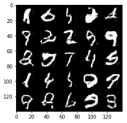
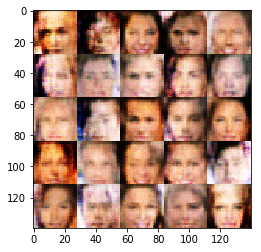

# Face Generation
In this project, you'll use generative adversarial networks to generate new images of faces.
### Get the Data
You'll be using two datasets in this project:
- MNIST
- CelebA

Since the celebA dataset is complex and you're doing GANs in a project for the first time, we want you to test your neural network on MNIST before CelebA.  Running the GANs on MNIST will allow you to see how well your model trains sooner.

If you're using [FloydHub](https://www.floydhub.com/), set `data_dir` to "/input" and use the [FloydHub data ID](http://docs.floydhub.com/home/using_datasets/) "R5KrjnANiKVhLWAkpXhNBe".


```python
data_dir = './data'

# FloydHub - Use with data ID "R5KrjnANiKVhLWAkpXhNBe"
#data_dir = '/input'


"""
DON'T MODIFY ANYTHING IN THIS CELL
"""
import helper

helper.download_extract('mnist', data_dir)
helper.download_extract('celeba', data_dir)
```

    Found mnist Data
    Found celeba Data


## Explore the Data
### MNIST
As you're aware, the [MNIST](http://yann.lecun.com/exdb/mnist/) dataset contains images of handwritten digits. You can view the first number of examples by changing `show_n_images`. 


```python
show_n_images = 25

"""
DON'T MODIFY ANYTHING IN THIS CELL
"""
%matplotlib inline
import os
from glob import glob
from matplotlib import pyplot

mnist_images = helper.get_batch(glob(os.path.join(data_dir, 'mnist/*.jpg'))[:show_n_images], 28, 28, 'L')
pyplot.imshow(helper.images_square_grid(mnist_images, 'L'), cmap='gray')
```


    <matplotlib.image.AxesImage at 0x7f6d9ab52828>


### CelebA
The [CelebFaces Attributes Dataset (CelebA)](http://mmlab.ie.cuhk.edu.hk/projects/CelebA.html) dataset contains over 200,000 celebrity images with annotations.  Since you're going to be generating faces, you won't need the annotations.  You can view the first number of examples by changing `show_n_images`.


```python
show_n_images = 25

"""
DON'T MODIFY ANYTHING IN THIS CELL
"""
mnist_images = helper.get_batch(glob(os.path.join(data_dir, 'img_align_celeba/*.jpg'))[:show_n_images], 28, 28, 'RGB')
pyplot.imshow(helper.images_square_grid(mnist_images, 'RGB'))
```


    <matplotlib.image.AxesImage at 0x7f6d9a99ccf8>


## Preprocess the Data
Since the project's main focus is on building the GANs, we'll preprocess the data for you.  The values of the MNIST and CelebA dataset will be in the range of -0.5 to 0.5 of 28x28 dimensional images.  The CelebA images will be cropped to remove parts of the image that don't include a face, then resized down to 28x28.

The MNIST images are black and white images with a single [color channel](https://en.wikipedia.org/wiki/Channel_(digital_image%29) while the CelebA images have [3 color channels (RGB color channel)](https://en.wikipedia.org/wiki/Channel_(digital_image%29#RGB_Images).
## Build the Neural Network
You'll build the components necessary to build a GANs by implementing the following functions below:
- `model_inputs`
- `discriminator`
- `generator`
- `model_loss`
- `model_opt`
- `train`

### Check the Version of TensorFlow and Access to GPU
This will check to make sure you have the correct version of TensorFlow and access to a GPU


```python
"""
DON'T MODIFY ANYTHING IN THIS CELL
"""
from distutils.version import LooseVersion
import warnings
import tensorflow as tf

# Check TensorFlow Version
assert LooseVersion(tf.__version__) >= LooseVersion('1.0'), 'Please use TensorFlow version 1.0 or newer.  You are using {}'.format(tf.__version__)
print('TensorFlow Version: {}'.format(tf.__version__))

# Check for a GPU
if not tf.test.gpu_device_name():
    warnings.warn('No GPU found. Please use a GPU to train your neural network.')
else:
    print('Default GPU Device: {}'.format(tf.test.gpu_device_name()))
```

    TensorFlow Version: 1.0.0
    Default GPU Device: /gpu:0


### Input
Implement the `model_inputs` function to create TF Placeholders for the Neural Network. It should create the following placeholders:
- Real input images placeholder with rank 4 using `image_width`, `image_height`, and `image_channels`.
- Z input placeholder with rank 2 using `z_dim`.
- Learning rate placeholder with rank 0.

Return the placeholders in the following the tuple (tensor of real input images, tensor of z data)


```python
import problem_unittests as tests

def model_inputs(image_width, image_height, image_channels, z_dim):
    """
    Create the model inputs
    :param image_width: The input image width
    :param image_height: The input image height
    :param image_channels: The number of image channels
    :param z_dim: The dimension of Z
    :return: Tuple of (tensor of real input images, tensor of z data, learning rate)
    """
    # TODO: Implement Function
    #the first none is the batch size
    input_images=tf.placeholder(tf.float32,shape=(None,image_width, image_height, image_channels),name="input_images")
    z_data=tf.placeholder(tf.float32,shape=(None,z_dim),name="z_data")
    learning_rate = tf.placeholder(tf.float32,name="learning_rate")

    return input_images, z_data, learning_rate


"""
DON'T MODIFY ANYTHING IN THIS CELL THAT IS BELOW THIS LINE
"""
tests.test_model_inputs(model_inputs)
```

    Tests Passed


### Discriminator
Implement `discriminator` to create a discriminator neural network that discriminates on `images`.  This function should be able to reuse the variabes in the neural network.  Use [`tf.variable_scope`](https://www.tensorflow.org/api_docs/python/tf/variable_scope) with a scope name of "discriminator" to allow the variables to be reused.  The function should return a tuple of (tensor output of the discriminator, tensor logits of the discriminator).


```python
#TIPP: Good value of alpha/ leak parameter has been chosen. However, still try lowering to 0.1 .

def leaky_relu(var,alpha=0.1): # like the idea of leaky relus and therefore want to use them here
    return tf.maximum(alpha * var, var)
    
def discriminator(images, reuse=False):
    """
    Create the discriminator network
    :param image: Tensor of input image(s)
    :param reuse: Boolean if the weights should be reused
    :return: Tuple of (tensor output of the discriminator, tensor logits of the discriminator)
    """
    # TODO: Implement Function - reusing a lot from the DCGAN.ipynb homework
    
    # TIPP: Use a smaller model for the discriminator relative to generator. 
    
    # TIPP: You used random_normal_intialiser. However, using weight initialization: 
    # Xavier initialization (A good blog link to help understand what it's) 
    # is recommended so as to break symmetry and thus, help converge faster as well as prevent local minima
    
    with tf.variable_scope('discriminator',reuse=reuse):
        # Input layer is 28x28x3 or 28x28x3
        x1 = tf.layers.conv2d(images, 32, 5, strides=2, padding='same',
                              kernel_initializer = tf.contrib.layers.xavier_initializer())#tf.random_normal_initializer(stddev=0.02))
        rl1 = leaky_relu(x1)
        # 14x14x32
        
        x2 = tf.layers.conv2d(rl1, 64, 5, strides=1, padding='same',
                              kernel_initializer = tf.contrib.layers.xavier_initializer())# tf.random_normal_initializer(stddev=0.02))
        bn2 = tf.layers.batch_normalization(x2, training=True)
        rl2 = leaky_relu(bn2)
        # 14x14x64
        
        x3 = tf.layers.conv2d(rl2, 256, 5, strides=2, padding='same',
                              kernel_initializer = tf.contrib.layers.xavier_initializer())# tf.random_normal_initializer(stddev=0.02))
        bn3 = tf.layers.batch_normalization(x3, training=True)
        rl3 = leaky_relu(bn3)
        
        # TIPP: Use Dropouts in discrimnator so as 
        # to make it less prone to the mistakes the 
        # generator can exploit instead of learning the 
        # data distribution as mentioned here. Possible 
        # tensorflow implementation can be achieved by simply 
        # passing the outputs from last layer into the tf.nn.dropout 
        # with a high keep_probability. USING tf.layers.dropout, thus I have to to 1-keep_prob
        # https://www.tensorflow.org/api_docs/python/tf/layers/dropout
        
        # 7x7x256
        # print ('shape', rl3.shape)

        do3 = tf.layers.dropout(rl3,rate=0.05)# 1-keep_prob of 0.95 = 0.05 cf. https://www.tensorflow.org/api_docs/python/tf/layers/dropout
        
        # Flatten it
        
        
        flat = tf.reshape(do3, (-1, 7*7*256))
        logits = tf.layers.dense(flat, 1)
        out = tf.sigmoid(logits)

    return out, logits


"""
DON'T MODIFY ANYTHING IN THIS CELL THAT IS BELOW THIS LINE
"""
tests.test_discriminator(discriminator, tf)
```

    Tests Passed


### Generator
Implement `generator` to generate an image using `z`. This function should be able to reuse the variabes in the neural network.  Use [`tf.variable_scope`](https://www.tensorflow.org/api_docs/python/tf/variable_scope) with a scope name of "generator" to allow the variables to be reused. The function should return the generated 28 x 28 x `out_channel_dim` images.


```python
def generator(z, out_channel_dim, is_train=True):
    """
    Create the generator network
    :param z: Input z
    :param out_channel_dim: The number of channels in the output image
    :param is_train: Boolean if generator is being used for training
    :return: The tensor output of the generator
    """
    # TODO: Implement Function - reusing a lot from the DCGAN.ipynb homework
    
    # TIPP: Use a smaller model for the discriminator relative to generator. 
    # Simply increase the number of filters for each layer in the generator by at least a 
    # factor of 2. Also, a sharp decline in generator from 1st to 2nd layer, for instance 
    # from 512 to 64, has shown to produce good results.
    
    # TIPP: Use Dropouts(50%) in generator in both train and test phase so as to provide noise 
    # and apply on several layers of generator at both training and test time. 
    # This was first introduced in a image tanslation paper called pix2pix for 
    # which you can check out an awesome demo here.
    
    with tf.variable_scope('generator',reuse= not is_train):
        # First fully connected layer
        fc1 = tf.layers.dense(z, 7*7*512)
        # Reshape it to start the convolutional stack
        
        
        
        x1 = tf.reshape(fc1, (-1, 7, 7, 512))
        bn1 = tf.layers.batch_normalization(x1, training=is_train)
        rl1 = leaky_relu(bn1)
        do1 = tf.layers.dropout(rl1,rate=0.5)
        # 7x7x512
        
        x2 = tf.layers.conv2d_transpose(do1, filters=128, kernel_size=7, strides=2, padding='same')
        bn2 = tf.layers.batch_normalization(x2, training=is_train)
        rl2 = leaky_relu(bn2)
        do2 = tf.layers.dropout(rl2,rate=0.5)
        # 14x14x128
        
        x3 = tf.layers.conv2d_transpose(do2, filters=64, kernel_size=5, strides=1, padding='same')
        bn3 = tf.layers.batch_normalization(x3, training=is_train)
        rl3 = leaky_relu(bn3)
        do3 = tf.layers.dropout(rl3,rate=0.5)
        # 14x14x64
        #print ('shape', rl3.shape)
        
        # Output layer
        logits = tf.layers.conv2d_transpose(do3, out_channel_dim, kernel_size=5, strides=2, padding='same')
        # 28x28x3 or 28x28x1
        
        out = tf.tanh(logits)
    
    return out


"""
DON'T MODIFY ANYTHING IN THIS CELL THAT IS BELOW THIS LINE
"""
tests.test_generator(generator, tf)
```

    Tests Passed


### Loss
Implement `model_loss` to build the GANs for training and calculate the loss.  The function should return a tuple of (discriminator loss, generator loss).  Use the following functions you implemented:
- `discriminator(images, reuse=False)`
- `generator(z, out_channel_dim, is_train=True)`


```python
def model_loss(input_real, input_z, out_channel_dim):
    """
    Get the loss for the discriminator and generator
    :param input_real: Images from the real dataset
    :param input_z: Z input
    :param out_channel_dim: The number of channels in the output image
    :return: A tuple of (discriminator loss, generator loss)
    """
    # TODO: Implement Function - reusing a lot from the DCGAN.ipynb homework
    
    
    # the real pipeline 
    dis_model_real, dis_logits_real = discriminator(input_real, reuse=False)
    
    
    # the generated pipeline
    gen_model = generator(input_z, out_channel_dim, is_train=True)
    dis_model_fake, dis_logits_fake = discriminator(gen_model, reuse=True)
    
    
    #calculating the loss for the real images
    dis_loss_real = tf.reduce_mean(
        tf.nn.sigmoid_cross_entropy_with_logits(logits=dis_logits_real, labels=tf.ones_like(dis_model_real)*0.9))#smoothin of 0.1
    #calculating the loss for the fake images
    dis_loss_fake = tf.reduce_mean(
        tf.nn.sigmoid_cross_entropy_with_logits(logits=dis_logits_fake, labels=tf.zeros_like(dis_model_fake)))
    # calculating the loss of the descriminator
    dis_loss = dis_loss_real + dis_loss_fake
    


    # calculating how well the generator tricks the desriminator
    gen_loss = tf.reduce_mean(
        tf.nn.sigmoid_cross_entropy_with_logits(logits=dis_logits_fake, labels=tf.ones_like(dis_model_fake)))
    
    return dis_loss, gen_loss


"""
DON'T MODIFY ANYTHING IN THIS CELL THAT IS BELOW THIS LINE
"""
tests.test_model_loss(model_loss)
```

    Tests Passed


### Optimization
Implement `model_opt` to create the optimization operations for the GANs. Use [`tf.trainable_variables`](https://www.tensorflow.org/api_docs/python/tf/trainable_variables) to get all the trainable variables.  Filter the variables with names that are in the discriminator and generator scope names.  The function should return a tuple of (discriminator training operation, generator training operation).


```python
def model_opt(d_loss, g_loss, learning_rate, beta1):
    """
    Get optimization operations
    :param d_loss: Discriminator loss Tensor
    :param g_loss: Generator loss Tensor
    :param learning_rate: Learning Rate Placeholder
    :param beta1: The exponential decay rate for the 1st moment in the optimizer
    :return: A tuple of (discriminator training operation, generator training operation)
    """
    # TODO: Implement Function - reusing a lot from the DCGAN.ipynb homework
    
    # Get variables for the different models
    t_vars = tf.trainable_variables()
    dis_vars = [var for var in t_vars if var.name.startswith('discriminator')]
    gen_vars = [var for var in t_vars if var.name.startswith('generator')]
    #print([var.name for var in t_vars])
    #print([var.name for var in dis_vars])
    #print([var.name for var in gen_vars])

    # Optimize
    with tf.control_dependencies(tf.get_collection(tf.GraphKeys.UPDATE_OPS)):
        dis_train_opt = tf.train.AdamOptimizer(learning_rate, beta1=beta1).minimize(d_loss, var_list=dis_vars)
        gen_train_opt = tf.train.AdamOptimizer(learning_rate, beta1=beta1).minimize(g_loss, var_list=gen_vars)

    return dis_train_opt, gen_train_opt

"""
DON'T MODIFY ANYTHING IN THIS CELL THAT IS BELOW THIS LINE
"""
tests.test_model_opt(model_opt, tf)
```

    Tests Passed


## Neural Network Training
### Show Output
Use this function to show the current output of the generator during training. It will help you determine how well the GANs is training.


```python
"""
DON'T MODIFY ANYTHING IN THIS CELL
"""
import numpy as np

def show_generator_output(sess, n_images, input_z, out_channel_dim, image_mode):
    """
    Show example output for the generator
    :param sess: TensorFlow session
    :param n_images: Number of Images to display
    :param input_z: Input Z Tensor
    :param out_channel_dim: The number of channels in the output image
    :param image_mode: The mode to use for images ("RGB" or "L")
    """
    cmap = None if image_mode == 'RGB' else 'gray'
    z_dim = input_z.get_shape().as_list()[-1]
    example_z = np.random.uniform(-1, 1, size=[n_images, z_dim])

    samples = sess.run(
        generator(input_z, out_channel_dim, False),
        feed_dict={input_z: example_z})

    images_grid = helper.images_square_grid(samples, image_mode)
    pyplot.imshow(images_grid, cmap=cmap)
    pyplot.show()
```

### Train
Implement `train` to build and train the GANs.  Use the following functions you implemented:
- `model_inputs(image_width, image_height, image_channels, z_dim)`
- `model_loss(input_real, input_z, out_channel_dim)`
- `model_opt(d_loss, g_loss, learning_rate, beta1)`

Use the `show_generator_output` to show `generator` output while you train. Running `show_generator_output` for every batch will drastically increase training time and increase the size of the notebook.  It's recommended to print the `generator` output every 100 batches.


```python
def train(epoch_count, batch_size, z_dim, learning_rate_, beta1, get_batches, data_shape, data_image_mode):
    """
    Train the GAN
    :param epoch_count: Number of epochs
    :param batch_size: Batch Size
    :param z_dim: Z dimension
    :param learning_rate: Learning Rate
    :param beta1: The exponential decay rate for the 1st moment in the optimizer
    :param get_batches: Function to get batches
    :param data_shape: Shape of the data
    :param data_image_mode: The image mode to use for images ("RGB" or "L")
    """
    # the last parameter data_image_mode can be always taken from data_shape[3] 3 gdw RGB 1 gdw L
    # TODO: Build Model - reusing a lot from the DCGAN.ipynb homework
    image_width = data_shape[1]
    image_height = data_shape[2] 
    image_channels = data_shape[3] # the last parameter data_image_mode can be always taken from data_shape[3] 3 gdw RGB 1 gdw L
    
    input_images, z_data, learning_rate = model_inputs(image_width, image_height, image_channels, z_dim)
    dis_loss, gen_loss = model_loss(input_images, z_data, image_channels)
    dis_opt, gen_opt = model_opt(dis_loss, gen_loss, learning_rate, beta1)
    
    steps = 0
    with tf.Session() as sess:
        sess.run(tf.global_variables_initializer())
        for epoch_i in range(epoch_count):
            for batch_images in get_batches(batch_size):
                steps += 1
                # Sample random noise for G
                
                batch_z = np.random.uniform(-1, 1, size=(batch_size, z_dim))

                # scale images to the size output of the tanh function -1.0 .. 1.0 from -0.5 .. 0.5 cf. helper.py
                images = batch_images * 2.0
                
                # Run optimizers
                _ = sess.run(dis_opt, feed_dict={input_images: images, z_data: batch_z, learning_rate: learning_rate_})
                _ = sess.run(gen_opt, feed_dict={input_images: images, z_data: batch_z, learning_rate: learning_rate_})
                
                if steps % 10 == 0:
                    # At the end of each epoch, get the losses and print them out
                    train_loss_dis = dis_loss.eval({input_images: images, z_data: batch_z, learning_rate: learning_rate_})
                    train_loss_gen = gen_loss.eval({input_images: images, z_data: batch_z, learning_rate: learning_rate_})
                    #show_generator_output(sess, 16, z_data, image_channels, data_image_mode)
                    print("Epoch {}/{} - steps: {}...".format(epoch_i+1, epochs,steps),
                          "Discriminator Loss: {:.4f}...".format(train_loss_dis),
                          "Generator Loss: {:.4f}".format(train_loss_gen))
                    
                if steps % 100 == 0:
                    show_generator_output(sess, 25, z_data, image_channels, data_image_mode)
        show_generator_output(sess, 25, z_data, image_channels, data_image_mode)
                
```

### MNIST
Test your GANs architecture on MNIST.  After 2 epochs, the GANs should be able to generate images that look like handwritten digits.  Make sure the loss of the generator is lower than the loss of the discriminator or close to 0.


```python
# HAVE TO CHANGE: Try reducing batch_size to (~32 to 64) because
batch_size = 64 #128
z_dim = 128
learning_rate = 0.0003
# Your chosen value for beta1 is goodish. 
# Though 0.5 seems to be the best choice and your results would have had even better looking faces!
beta1 = 0.5 #0.3

# https://www.tensorflow.org/versions/master/api_docs/python/tf/train/AdamOptimizer
# lr_t <- learning_rate * sqrt(1 - beta2^t) / (1 - beta1^t)

tf.reset_default_graph()
"""
DON'T MODIFY ANYTHING IN THIS CELL THAT IS BELOW THIS LINE
"""
epochs = 2

mnist_dataset= helper.Dataset('mnist', glob(os.path.join(data_dir, 'mnist/*.jpg')))
with tf.Graph().as_default():
    train(epochs, batch_size, z_dim, learning_rate, beta1, mnist_dataset.get_batches,
          mnist_dataset.shape, mnist_dataset.image_mode)
```

    Epoch 1/2 - steps: 10... Discriminator Loss: 0.7126... Generator Loss: 1.3429
    Epoch 1/2 - steps: 20... Discriminator Loss: 1.7239... Generator Loss: 0.3434
    Epoch 1/2 - steps: 30... Discriminator Loss: 0.6723... Generator Loss: 4.5823
    Epoch 1/2 - steps: 40... Discriminator Loss: 1.0976... Generator Loss: 0.7483
    Epoch 1/2 - steps: 50... Discriminator Loss: 0.5864... Generator Loss: 5.3739
    Epoch 1/2 - steps: 60... Discriminator Loss: 1.0515... Generator Loss: 1.1012
    Epoch 1/2 - steps: 70... Discriminator Loss: 1.1156... Generator Loss: 1.1039
    Epoch 1/2 - steps: 80... Discriminator Loss: 1.4043... Generator Loss: 0.6610
    Epoch 1/2 - steps: 90... Discriminator Loss: 1.1502... Generator Loss: 2.4073
    Epoch 1/2 - steps: 100... Discriminator Loss: 1.7008... Generator Loss: 0.3749


    Epoch 1/2 - steps: 110... Discriminator Loss: 1.8895... Generator Loss: 3.1431
    Epoch 1/2 - steps: 120... Discriminator Loss: 0.9386... Generator Loss: 1.0539
    Epoch 1/2 - steps: 130... Discriminator Loss: 1.2876... Generator Loss: 0.6007
    Epoch 1/2 - steps: 140... Discriminator Loss: 0.9713... Generator Loss: 1.1147
    Epoch 1/2 - steps: 150... Discriminator Loss: 0.9775... Generator Loss: 0.9548
    Epoch 1/2 - steps: 160... Discriminator Loss: 0.9939... Generator Loss: 1.1204
    Epoch 1/2 - steps: 170... Discriminator Loss: 0.8804... Generator Loss: 1.6549
    Epoch 1/2 - steps: 180... Discriminator Loss: 1.7247... Generator Loss: 0.3326
    Epoch 1/2 - steps: 190... Discriminator Loss: 0.9297... Generator Loss: 1.9452
    Epoch 1/2 - steps: 200... Discriminator Loss: 0.9023... Generator Loss: 1.0805


    Epoch 1/2 - steps: 210... Discriminator Loss: 0.7786... Generator Loss: 1.8562
    Epoch 1/2 - steps: 220... Discriminator Loss: 0.9544... Generator Loss: 2.2838
    Epoch 1/2 - steps: 230... Discriminator Loss: 0.9237... Generator Loss: 1.4470
    Epoch 1/2 - steps: 240... Discriminator Loss: 0.7824... Generator Loss: 1.4611
    Epoch 1/2 - steps: 250... Discriminator Loss: 0.8464... Generator Loss: 1.1689
    Epoch 1/2 - steps: 260... Discriminator Loss: 0.8365... Generator Loss: 1.2816
    Epoch 1/2 - steps: 270... Discriminator Loss: 1.0716... Generator Loss: 0.7780
    Epoch 1/2 - steps: 280... Discriminator Loss: 1.2409... Generator Loss: 0.6380
    Epoch 1/2 - steps: 290... Discriminator Loss: 0.9908... Generator Loss: 1.8600
    Epoch 1/2 - steps: 300... Discriminator Loss: 1.0900... Generator Loss: 0.7520


    Epoch 1/2 - steps: 310... Discriminator Loss: 1.0244... Generator Loss: 0.9455
    Epoch 1/2 - steps: 320... Discriminator Loss: 0.9391... Generator Loss: 1.1515
    Epoch 1/2 - steps: 330... Discriminator Loss: 1.0140... Generator Loss: 1.9726
    Epoch 1/2 - steps: 340... Discriminator Loss: 1.1308... Generator Loss: 2.1162
    Epoch 1/2 - steps: 350... Discriminator Loss: 1.1425... Generator Loss: 0.7612
    Epoch 1/2 - steps: 360... Discriminator Loss: 0.9507... Generator Loss: 1.0814
    Epoch 1/2 - steps: 370... Discriminator Loss: 0.9279... Generator Loss: 1.4162
    Epoch 1/2 - steps: 380... Discriminator Loss: 0.9353... Generator Loss: 1.6230
    Epoch 1/2 - steps: 390... Discriminator Loss: 1.5807... Generator Loss: 0.4046
    Epoch 1/2 - steps: 400... Discriminator Loss: 1.1258... Generator Loss: 0.7676


    Epoch 1/2 - steps: 410... Discriminator Loss: 0.9306... Generator Loss: 1.5414
    Epoch 1/2 - steps: 420... Discriminator Loss: 1.1152... Generator Loss: 1.3005
    Epoch 1/2 - steps: 430... Discriminator Loss: 1.0497... Generator Loss: 1.7073
    Epoch 1/2 - steps: 440... Discriminator Loss: 1.6706... Generator Loss: 0.3746
    Epoch 1/2 - steps: 450... Discriminator Loss: 1.1922... Generator Loss: 1.6861
    Epoch 1/2 - steps: 460... Discriminator Loss: 1.4665... Generator Loss: 2.0657
    Epoch 1/2 - steps: 470... Discriminator Loss: 1.2754... Generator Loss: 0.5618
    Epoch 1/2 - steps: 480... Discriminator Loss: 1.1894... Generator Loss: 0.6848
    Epoch 1/2 - steps: 490... Discriminator Loss: 1.0386... Generator Loss: 1.0974
    Epoch 1/2 - steps: 500... Discriminator Loss: 1.3998... Generator Loss: 0.4988


    Epoch 1/2 - steps: 510... Discriminator Loss: 1.8778... Generator Loss: 2.9369
    Epoch 1/2 - steps: 520... Discriminator Loss: 1.0199... Generator Loss: 1.0408
    Epoch 1/2 - steps: 530... Discriminator Loss: 1.1750... Generator Loss: 0.7273
    Epoch 1/2 - steps: 540... Discriminator Loss: 0.9661... Generator Loss: 1.1284
    Epoch 1/2 - steps: 550... Discriminator Loss: 1.2820... Generator Loss: 2.1454
    Epoch 1/2 - steps: 560... Discriminator Loss: 1.4160... Generator Loss: 0.5380
    Epoch 1/2 - steps: 570... Discriminator Loss: 1.1084... Generator Loss: 0.9813
    Epoch 1/2 - steps: 580... Discriminator Loss: 1.1769... Generator Loss: 0.7606
    Epoch 1/2 - steps: 590... Discriminator Loss: 1.2636... Generator Loss: 0.6598
    Epoch 1/2 - steps: 600... Discriminator Loss: 1.0537... Generator Loss: 1.5522


    Epoch 1/2 - steps: 610... Discriminator Loss: 0.9791... Generator Loss: 1.1414
    Epoch 1/2 - steps: 620... Discriminator Loss: 1.2080... Generator Loss: 1.9747
    Epoch 1/2 - steps: 630... Discriminator Loss: 1.0643... Generator Loss: 1.1994
    Epoch 1/2 - steps: 640... Discriminator Loss: 1.0849... Generator Loss: 1.0212
    Epoch 1/2 - steps: 650... Discriminator Loss: 1.4842... Generator Loss: 0.4374
    Epoch 1/2 - steps: 660... Discriminator Loss: 2.7169... Generator Loss: 4.3100
    Epoch 1/2 - steps: 670... Discriminator Loss: 1.2183... Generator Loss: 0.6738
    Epoch 1/2 - steps: 680... Discriminator Loss: 1.2994... Generator Loss: 0.6997
    Epoch 1/2 - steps: 690... Discriminator Loss: 1.2339... Generator Loss: 0.6249
    Epoch 1/2 - steps: 700... Discriminator Loss: 0.9898... Generator Loss: 1.0695


    Epoch 1/2 - steps: 710... Discriminator Loss: 1.0667... Generator Loss: 0.8123
    Epoch 1/2 - steps: 720... Discriminator Loss: 0.9018... Generator Loss: 1.4982
    Epoch 1/2 - steps: 730... Discriminator Loss: 1.6222... Generator Loss: 2.2286
    Epoch 1/2 - steps: 740... Discriminator Loss: 1.1545... Generator Loss: 1.0975
    Epoch 1/2 - steps: 750... Discriminator Loss: 0.9882... Generator Loss: 1.1130
    Epoch 1/2 - steps: 760... Discriminator Loss: 1.2360... Generator Loss: 0.6209
    Epoch 1/2 - steps: 770... Discriminator Loss: 1.5745... Generator Loss: 0.3995
    Epoch 1/2 - steps: 780... Discriminator Loss: 1.1863... Generator Loss: 0.7160
    Epoch 1/2 - steps: 790... Discriminator Loss: 1.1519... Generator Loss: 0.8019
    Epoch 1/2 - steps: 800... Discriminator Loss: 1.0846... Generator Loss: 0.8037


    Epoch 1/2 - steps: 810... Discriminator Loss: 0.9328... Generator Loss: 1.3406
    Epoch 1/2 - steps: 820... Discriminator Loss: 0.8497... Generator Loss: 1.4065
    Epoch 1/2 - steps: 830... Discriminator Loss: 1.2611... Generator Loss: 1.3308
    Epoch 1/2 - steps: 840... Discriminator Loss: 1.3278... Generator Loss: 0.7863
    Epoch 1/2 - steps: 850... Discriminator Loss: 1.3590... Generator Loss: 0.5797
    Epoch 1/2 - steps: 860... Discriminator Loss: 1.4547... Generator Loss: 0.4603
    Epoch 1/2 - steps: 870... Discriminator Loss: 1.5998... Generator Loss: 0.3992
    Epoch 1/2 - steps: 880... Discriminator Loss: 0.8771... Generator Loss: 1.3228
    Epoch 1/2 - steps: 890... Discriminator Loss: 1.4317... Generator Loss: 0.5167
    Epoch 1/2 - steps: 900... Discriminator Loss: 1.2166... Generator Loss: 0.6562


    Epoch 1/2 - steps: 910... Discriminator Loss: 1.0692... Generator Loss: 0.8657
    Epoch 1/2 - steps: 920... Discriminator Loss: 1.0489... Generator Loss: 0.9944
    Epoch 1/2 - steps: 930... Discriminator Loss: 1.2286... Generator Loss: 0.6538
    Epoch 2/2 - steps: 940... Discriminator Loss: 0.9317... Generator Loss: 1.1369
    Epoch 2/2 - steps: 950... Discriminator Loss: 1.0030... Generator Loss: 0.9488
    Epoch 2/2 - steps: 960... Discriminator Loss: 2.5143... Generator Loss: 0.1652
    Epoch 2/2 - steps: 970... Discriminator Loss: 1.0514... Generator Loss: 1.1045
    Epoch 2/2 - steps: 980... Discriminator Loss: 1.1301... Generator Loss: 1.3966
    Epoch 2/2 - steps: 990... Discriminator Loss: 1.1085... Generator Loss: 0.7443
    Epoch 2/2 - steps: 1000... Discriminator Loss: 1.0804... Generator Loss: 0.8668


    Epoch 2/2 - steps: 1010... Discriminator Loss: 0.9709... Generator Loss: 0.9743
    Epoch 2/2 - steps: 1020... Discriminator Loss: 0.9702... Generator Loss: 0.9480
    Epoch 2/2 - steps: 1030... Discriminator Loss: 1.0507... Generator Loss: 0.8960
    Epoch 2/2 - steps: 1040... Discriminator Loss: 1.0882... Generator Loss: 0.8471
    Epoch 2/2 - steps: 1050... Discriminator Loss: 1.1563... Generator Loss: 0.7271
    Epoch 2/2 - steps: 1060... Discriminator Loss: 1.4316... Generator Loss: 0.5063
    Epoch 2/2 - steps: 1070... Discriminator Loss: 0.9984... Generator Loss: 0.9392
    Epoch 2/2 - steps: 1080... Discriminator Loss: 1.0248... Generator Loss: 1.0017
    Epoch 2/2 - steps: 1090... Discriminator Loss: 1.0212... Generator Loss: 0.8594
    Epoch 2/2 - steps: 1100... Discriminator Loss: 0.9843... Generator Loss: 0.9395


    Epoch 2/2 - steps: 1110... Discriminator Loss: 0.9079... Generator Loss: 1.6446
    Epoch 2/2 - steps: 1120... Discriminator Loss: 1.0096... Generator Loss: 1.2574
    Epoch 2/2 - steps: 1130... Discriminator Loss: 1.1837... Generator Loss: 0.6562
    Epoch 2/2 - steps: 1140... Discriminator Loss: 0.9929... Generator Loss: 1.0912
    Epoch 2/2 - steps: 1150... Discriminator Loss: 1.1036... Generator Loss: 1.3937
    Epoch 2/2 - steps: 1160... Discriminator Loss: 1.5017... Generator Loss: 0.4507
    Epoch 2/2 - steps: 1170... Discriminator Loss: 1.1534... Generator Loss: 2.2927
    Epoch 2/2 - steps: 1180... Discriminator Loss: 1.4409... Generator Loss: 0.4780
    Epoch 2/2 - steps: 1190... Discriminator Loss: 0.9359... Generator Loss: 1.2590
    Epoch 2/2 - steps: 1200... Discriminator Loss: 1.3546... Generator Loss: 0.5406


    Epoch 2/2 - steps: 1210... Discriminator Loss: 1.4442... Generator Loss: 0.4893
    Epoch 2/2 - steps: 1220... Discriminator Loss: 0.8815... Generator Loss: 1.3347
    Epoch 2/2 - steps: 1230... Discriminator Loss: 1.0259... Generator Loss: 1.1032
    Epoch 2/2 - steps: 1240... Discriminator Loss: 2.3352... Generator Loss: 4.0157
    Epoch 2/2 - steps: 1250... Discriminator Loss: 1.0222... Generator Loss: 1.3119
    Epoch 2/2 - steps: 1260... Discriminator Loss: 1.1536... Generator Loss: 1.5991
    Epoch 2/2 - steps: 1270... Discriminator Loss: 1.5470... Generator Loss: 2.5556
    Epoch 2/2 - steps: 1280... Discriminator Loss: 0.9838... Generator Loss: 0.8954
    Epoch 2/2 - steps: 1290... Discriminator Loss: 0.9729... Generator Loss: 0.9698
    Epoch 2/2 - steps: 1300... Discriminator Loss: 1.0296... Generator Loss: 1.7822


    Epoch 2/2 - steps: 1310... Discriminator Loss: 1.1146... Generator Loss: 0.8812
    Epoch 2/2 - steps: 1320... Discriminator Loss: 1.1435... Generator Loss: 1.3418
    Epoch 2/2 - steps: 1330... Discriminator Loss: 1.0437... Generator Loss: 0.8956
    Epoch 2/2 - steps: 1340... Discriminator Loss: 1.9213... Generator Loss: 0.2891
    Epoch 2/2 - steps: 1350... Discriminator Loss: 0.9865... Generator Loss: 1.0700
    Epoch 2/2 - steps: 1360... Discriminator Loss: 1.3437... Generator Loss: 0.6154
    Epoch 2/2 - steps: 1370... Discriminator Loss: 1.2649... Generator Loss: 0.6242
    Epoch 2/2 - steps: 1380... Discriminator Loss: 1.0418... Generator Loss: 0.9108
    Epoch 2/2 - steps: 1390... Discriminator Loss: 0.8595... Generator Loss: 1.4108
    Epoch 2/2 - steps: 1400... Discriminator Loss: 1.0274... Generator Loss: 0.8811


    Epoch 2/2 - steps: 1410... Discriminator Loss: 0.8692... Generator Loss: 1.4135
    Epoch 2/2 - steps: 1420... Discriminator Loss: 1.9497... Generator Loss: 0.3159
    Epoch 2/2 - steps: 1430... Discriminator Loss: 1.1235... Generator Loss: 1.2704
    Epoch 2/2 - steps: 1440... Discriminator Loss: 1.0782... Generator Loss: 1.6505
    Epoch 2/2 - steps: 1450... Discriminator Loss: 1.0661... Generator Loss: 1.2089
    Epoch 2/2 - steps: 1460... Discriminator Loss: 1.1654... Generator Loss: 0.6988
    Epoch 2/2 - steps: 1470... Discriminator Loss: 0.8980... Generator Loss: 1.4807
    Epoch 2/2 - steps: 1480... Discriminator Loss: 1.5534... Generator Loss: 0.4553
    Epoch 2/2 - steps: 1490... Discriminator Loss: 0.9287... Generator Loss: 1.3424
    Epoch 2/2 - steps: 1500... Discriminator Loss: 1.1905... Generator Loss: 0.8050


    Epoch 2/2 - steps: 1510... Discriminator Loss: 1.3509... Generator Loss: 0.6235
    Epoch 2/2 - steps: 1520... Discriminator Loss: 1.1247... Generator Loss: 0.8603
    Epoch 2/2 - steps: 1530... Discriminator Loss: 1.0731... Generator Loss: 0.7876
    Epoch 2/2 - steps: 1540... Discriminator Loss: 1.1654... Generator Loss: 0.6995
    Epoch 2/2 - steps: 1550... Discriminator Loss: 1.0213... Generator Loss: 0.8452
    Epoch 2/2 - steps: 1560... Discriminator Loss: 1.1553... Generator Loss: 0.8236
    Epoch 2/2 - steps: 1570... Discriminator Loss: 0.9859... Generator Loss: 1.0103
    Epoch 2/2 - steps: 1580... Discriminator Loss: 0.9795... Generator Loss: 1.0789
    Epoch 2/2 - steps: 1590... Discriminator Loss: 0.9623... Generator Loss: 1.6236
    Epoch 2/2 - steps: 1600... Discriminator Loss: 0.9100... Generator Loss: 1.2785





    Epoch 2/2 - steps: 1610... Discriminator Loss: 1.8402... Generator Loss: 0.3223
    Epoch 2/2 - steps: 1620... Discriminator Loss: 1.2763... Generator Loss: 2.3459
    Epoch 2/2 - steps: 1630... Discriminator Loss: 0.8651... Generator Loss: 1.6090
    Epoch 2/2 - steps: 1640... Discriminator Loss: 0.9636... Generator Loss: 1.5059
    Epoch 2/2 - steps: 1650... Discriminator Loss: 1.1413... Generator Loss: 0.7619
    Epoch 2/2 - steps: 1660... Discriminator Loss: 1.0412... Generator Loss: 1.1124
    Epoch 2/2 - steps: 1670... Discriminator Loss: 0.8965... Generator Loss: 1.1992
    Epoch 2/2 - steps: 1680... Discriminator Loss: 0.7991... Generator Loss: 1.4891
    Epoch 2/2 - steps: 1690... Discriminator Loss: 0.8658... Generator Loss: 1.2513
    Epoch 2/2 - steps: 1700... Discriminator Loss: 0.9844... Generator Loss: 0.9015


    Epoch 2/2 - steps: 1710... Discriminator Loss: 1.0486... Generator Loss: 0.8411
    Epoch 2/2 - steps: 1720... Discriminator Loss: 4.1054... Generator Loss: 3.9610
    Epoch 2/2 - steps: 1730... Discriminator Loss: 1.0834... Generator Loss: 1.0432
    Epoch 2/2 - steps: 1740... Discriminator Loss: 1.0656... Generator Loss: 1.0728
    Epoch 2/2 - steps: 1750... Discriminator Loss: 0.8889... Generator Loss: 1.4763
    Epoch 2/2 - steps: 1760... Discriminator Loss: 1.0745... Generator Loss: 0.9429
    Epoch 2/2 - steps: 1770... Discriminator Loss: 0.9804... Generator Loss: 1.8591
    Epoch 2/2 - steps: 1780... Discriminator Loss: 1.0416... Generator Loss: 0.8244
    Epoch 2/2 - steps: 1790... Discriminator Loss: 2.5032... Generator Loss: 4.0571
    Epoch 2/2 - steps: 1800... Discriminator Loss: 1.2730... Generator Loss: 0.6406


    Epoch 2/2 - steps: 1810... Discriminator Loss: 1.2139... Generator Loss: 0.6540
    Epoch 2/2 - steps: 1820... Discriminator Loss: 1.2663... Generator Loss: 0.6474
    Epoch 2/2 - steps: 1830... Discriminator Loss: 1.1823... Generator Loss: 0.7229
    Epoch 2/2 - steps: 1840... Discriminator Loss: 0.9566... Generator Loss: 1.0015
    Epoch 2/2 - steps: 1850... Discriminator Loss: 1.0334... Generator Loss: 0.9724
    Epoch 2/2 - steps: 1860... Discriminator Loss: 0.9341... Generator Loss: 1.6245
    Epoch 2/2 - steps: 1870... Discriminator Loss: 0.8398... Generator Loss: 1.4737


### CelebA
Run your GANs on CelebA.  It will take around 20 minutes on the average GPU to run one epoch.  You can run the whole epoch or stop when it starts to generate realistic faces.


```python
# HAVE TO CHANGE: Try reducing batch_size to (~32 to 64) because
batch_size = 64 #128
z_dim = 128
learning_rate = 0.0003
# Your chosen value for beta1 is goodish. 
# Though 0.5 seems to be the best choice and your results would have had even better looking faces!
beta1 = 0.5 #0.3
"""
DON'T MODIFY ANYTHING IN THIS CELL THAT IS BELOW THIS LINE
"""
epochs = 1

celeba_dataset = helper.Dataset('celeba', glob(os.path.join(data_dir, 'img_align_celeba/*.jpg')))
with tf.Graph().as_default():
    train(epochs, batch_size, z_dim, learning_rate, beta1, celeba_dataset.get_batches,
          celeba_dataset.shape, celeba_dataset.image_mode)
```

    Epoch 1/1 - steps: 10... Discriminator Loss: 1.0133... Generator Loss: 1.0313
    Epoch 1/1 - steps: 20... Discriminator Loss: 1.0642... Generator Loss: 0.9373
    Epoch 1/1 - steps: 30... Discriminator Loss: 0.4719... Generator Loss: 3.9139
    Epoch 1/1 - steps: 40... Discriminator Loss: 0.5369... Generator Loss: 2.1443
    Epoch 1/1 - steps: 50... Discriminator Loss: 0.5321... Generator Loss: 2.4079
    Epoch 1/1 - steps: 60... Discriminator Loss: 2.9199... Generator Loss: 7.1959
    Epoch 1/1 - steps: 70... Discriminator Loss: 1.3708... Generator Loss: 0.7825
    Epoch 1/1 - steps: 80... Discriminator Loss: 1.5068... Generator Loss: 0.6228
    Epoch 1/1 - steps: 90... Discriminator Loss: 1.4505... Generator Loss: 0.5829
    Epoch 1/1 - steps: 100... Discriminator Loss: 1.8354... Generator Loss: 0.3958


    Epoch 1/1 - steps: 110... Discriminator Loss: 1.0264... Generator Loss: 1.0010
    Epoch 1/1 - steps: 120... Discriminator Loss: 0.9716... Generator Loss: 1.2845
    Epoch 1/1 - steps: 130... Discriminator Loss: 0.8703... Generator Loss: 2.0456
    Epoch 1/1 - steps: 140... Discriminator Loss: 1.1202... Generator Loss: 0.9687
    Epoch 1/1 - steps: 150... Discriminator Loss: 1.0683... Generator Loss: 0.9439
    Epoch 1/1 - steps: 160... Discriminator Loss: 1.2701... Generator Loss: 0.8486
    Epoch 1/1 - steps: 170... Discriminator Loss: 1.3625... Generator Loss: 0.6864
    Epoch 1/1 - steps: 180... Discriminator Loss: 1.4030... Generator Loss: 0.8222
    Epoch 1/1 - steps: 190... Discriminator Loss: 1.7234... Generator Loss: 3.0646
    Epoch 1/1 - steps: 200... Discriminator Loss: 1.1709... Generator Loss: 0.6986


    Epoch 1/1 - steps: 210... Discriminator Loss: 1.7113... Generator Loss: 2.9928
    Epoch 1/1 - steps: 220... Discriminator Loss: 1.3969... Generator Loss: 0.6541
    Epoch 1/1 - steps: 230... Discriminator Loss: 0.8797... Generator Loss: 1.2267
    Epoch 1/1 - steps: 240... Discriminator Loss: 1.1538... Generator Loss: 2.4064
    Epoch 1/1 - steps: 250... Discriminator Loss: 0.9271... Generator Loss: 1.1783
    Epoch 1/1 - steps: 260... Discriminator Loss: 1.6572... Generator Loss: 0.4221
    Epoch 1/1 - steps: 270... Discriminator Loss: 1.2670... Generator Loss: 0.7764
    Epoch 1/1 - steps: 280... Discriminator Loss: 0.7017... Generator Loss: 1.8939
    Epoch 1/1 - steps: 290... Discriminator Loss: 1.1076... Generator Loss: 1.0010
    Epoch 1/1 - steps: 300... Discriminator Loss: 1.5591... Generator Loss: 0.5285


    Epoch 1/1 - steps: 310... Discriminator Loss: 2.1164... Generator Loss: 0.2548
    Epoch 1/1 - steps: 320... Discriminator Loss: 1.3705... Generator Loss: 0.8298
    Epoch 1/1 - steps: 330... Discriminator Loss: 0.8961... Generator Loss: 1.3394
    Epoch 1/1 - steps: 340... Discriminator Loss: 0.9328... Generator Loss: 1.1678
    Epoch 1/1 - steps: 350... Discriminator Loss: 1.1097... Generator Loss: 0.8491
    Epoch 1/1 - steps: 360... Discriminator Loss: 0.9292... Generator Loss: 0.9646
    Epoch 1/1 - steps: 370... Discriminator Loss: 1.6146... Generator Loss: 0.4376
    Epoch 1/1 - steps: 380... Discriminator Loss: 1.0262... Generator Loss: 0.9313
    Epoch 1/1 - steps: 390... Discriminator Loss: 0.9070... Generator Loss: 0.9831
    Epoch 1/1 - steps: 400... Discriminator Loss: 1.5866... Generator Loss: 0.4141


    Epoch 1/1 - steps: 410... Discriminator Loss: 1.5883... Generator Loss: 0.4203
    Epoch 1/1 - steps: 420... Discriminator Loss: 0.8582... Generator Loss: 1.2395
    Epoch 1/1 - steps: 430... Discriminator Loss: 0.8154... Generator Loss: 1.3765
    Epoch 1/1 - steps: 440... Discriminator Loss: 1.6569... Generator Loss: 0.4228
    Epoch 1/1 - steps: 450... Discriminator Loss: 1.4931... Generator Loss: 5.1950
    Epoch 1/1 - steps: 460... Discriminator Loss: 0.9983... Generator Loss: 0.8948
    Epoch 1/1 - steps: 470... Discriminator Loss: 1.7477... Generator Loss: 3.2900
    Epoch 1/1 - steps: 480... Discriminator Loss: 1.3340... Generator Loss: 0.5901
    Epoch 1/1 - steps: 490... Discriminator Loss: 0.7255... Generator Loss: 2.2228
    Epoch 1/1 - steps: 500... Discriminator Loss: 0.7667... Generator Loss: 2.9348


    Epoch 1/1 - steps: 510... Discriminator Loss: 1.3962... Generator Loss: 0.5530
    Epoch 1/1 - steps: 520... Discriminator Loss: 1.1043... Generator Loss: 0.7856
    Epoch 1/1 - steps: 530... Discriminator Loss: 0.5351... Generator Loss: 3.8390
    Epoch 1/1 - steps: 540... Discriminator Loss: 0.6750... Generator Loss: 2.9318
    Epoch 1/1 - steps: 550... Discriminator Loss: 0.7716... Generator Loss: 3.9372
    Epoch 1/1 - steps: 560... Discriminator Loss: 1.1776... Generator Loss: 3.5039
    Epoch 1/1 - steps: 570... Discriminator Loss: 0.9631... Generator Loss: 1.0211
    Epoch 1/1 - steps: 580... Discriminator Loss: 0.7966... Generator Loss: 1.3414
    Epoch 1/1 - steps: 590... Discriminator Loss: 0.9748... Generator Loss: 0.9995
    Epoch 1/1 - steps: 600... Discriminator Loss: 1.6289... Generator Loss: 0.3937


    Epoch 1/1 - steps: 610... Discriminator Loss: 0.7784... Generator Loss: 2.7533
    Epoch 1/1 - steps: 620... Discriminator Loss: 0.9323... Generator Loss: 0.9823
    Epoch 1/1 - steps: 630... Discriminator Loss: 1.1935... Generator Loss: 3.3752
    Epoch 1/1 - steps: 640... Discriminator Loss: 0.7837... Generator Loss: 1.6559
    Epoch 1/1 - steps: 650... Discriminator Loss: 1.4939... Generator Loss: 0.4857
    Epoch 1/1 - steps: 660... Discriminator Loss: 1.0384... Generator Loss: 0.8381
    Epoch 1/1 - steps: 670... Discriminator Loss: 0.7568... Generator Loss: 1.4736
    Epoch 1/1 - steps: 680... Discriminator Loss: 1.6319... Generator Loss: 2.5229
    Epoch 1/1 - steps: 690... Discriminator Loss: 0.8557... Generator Loss: 1.2343
    Epoch 1/1 - steps: 700... Discriminator Loss: 1.2519... Generator Loss: 2.5643





    Epoch 1/1 - steps: 710... Discriminator Loss: 1.6692... Generator Loss: 4.1410
    Epoch 1/1 - steps: 720... Discriminator Loss: 0.8269... Generator Loss: 1.6399
    Epoch 1/1 - steps: 730... Discriminator Loss: 0.7344... Generator Loss: 1.8545
    Epoch 1/1 - steps: 740... Discriminator Loss: 1.0699... Generator Loss: 0.7745
    Epoch 1/1 - steps: 750... Discriminator Loss: 1.5069... Generator Loss: 2.1602
    Epoch 1/1 - steps: 760... Discriminator Loss: 1.3247... Generator Loss: 0.9887
    Epoch 1/1 - steps: 770... Discriminator Loss: 1.0507... Generator Loss: 1.4680
    Epoch 1/1 - steps: 780... Discriminator Loss: 0.8177... Generator Loss: 1.6029
    Epoch 1/1 - steps: 790... Discriminator Loss: 1.0205... Generator Loss: 1.3139
    Epoch 1/1 - steps: 800... Discriminator Loss: 1.4130... Generator Loss: 0.5668


    Epoch 1/1 - steps: 810... Discriminator Loss: 1.1071... Generator Loss: 0.8678
    Epoch 1/1 - steps: 820... Discriminator Loss: 1.1051... Generator Loss: 1.5479
    Epoch 1/1 - steps: 830... Discriminator Loss: 1.0069... Generator Loss: 1.8808
    Epoch 1/1 - steps: 840... Discriminator Loss: 1.0643... Generator Loss: 0.8949
    Epoch 1/1 - steps: 850... Discriminator Loss: 0.8410... Generator Loss: 3.0856
    Epoch 1/1 - steps: 860... Discriminator Loss: 0.8513... Generator Loss: 1.8430
    Epoch 1/1 - steps: 870... Discriminator Loss: 1.8861... Generator Loss: 1.5795
    Epoch 1/1 - steps: 880... Discriminator Loss: 1.2118... Generator Loss: 1.2165
    Epoch 1/1 - steps: 890... Discriminator Loss: 1.3771... Generator Loss: 0.5502
    Epoch 1/1 - steps: 900... Discriminator Loss: 1.3253... Generator Loss: 0.6143


    Epoch 1/1 - steps: 910... Discriminator Loss: 1.0547... Generator Loss: 1.2309
    Epoch 1/1 - steps: 920... Discriminator Loss: 0.8548... Generator Loss: 1.1411
    Epoch 1/1 - steps: 930... Discriminator Loss: 1.1339... Generator Loss: 1.4732
    Epoch 1/1 - steps: 940... Discriminator Loss: 0.9641... Generator Loss: 1.7942
    Epoch 1/1 - steps: 950... Discriminator Loss: 1.1852... Generator Loss: 0.8061
    Epoch 1/1 - steps: 960... Discriminator Loss: 1.0003... Generator Loss: 1.8607
    Epoch 1/1 - steps: 970... Discriminator Loss: 1.1120... Generator Loss: 0.8796
    Epoch 1/1 - steps: 980... Discriminator Loss: 1.3287... Generator Loss: 1.9590
    Epoch 1/1 - steps: 990... Discriminator Loss: 1.3587... Generator Loss: 0.6557
    Epoch 1/1 - steps: 1000... Discriminator Loss: 1.1245... Generator Loss: 1.4597


    Epoch 1/1 - steps: 1010... Discriminator Loss: 1.7052... Generator Loss: 4.3764
    Epoch 1/1 - steps: 1020... Discriminator Loss: 1.0509... Generator Loss: 0.9990
    Epoch 1/1 - steps: 1030... Discriminator Loss: 1.1798... Generator Loss: 0.9635
    Epoch 1/1 - steps: 1040... Discriminator Loss: 1.0998... Generator Loss: 2.1969
    Epoch 1/1 - steps: 1050... Discriminator Loss: 1.0442... Generator Loss: 1.1914
    Epoch 1/1 - steps: 1060... Discriminator Loss: 1.0359... Generator Loss: 0.9552
    Epoch 1/1 - steps: 1070... Discriminator Loss: 1.1671... Generator Loss: 0.9219
    Epoch 1/1 - steps: 1080... Discriminator Loss: 1.4937... Generator Loss: 0.4999
    Epoch 1/1 - steps: 1090... Discriminator Loss: 1.3276... Generator Loss: 0.5968
    Epoch 1/1 - steps: 1100... Discriminator Loss: 0.7813... Generator Loss: 2.2406


    Epoch 1/1 - steps: 1110... Discriminator Loss: 0.9583... Generator Loss: 1.0704
    Epoch 1/1 - steps: 1120... Discriminator Loss: 1.2758... Generator Loss: 0.6927
    Epoch 1/1 - steps: 1130... Discriminator Loss: 1.3149... Generator Loss: 0.5794
    Epoch 1/1 - steps: 1140... Discriminator Loss: 1.2596... Generator Loss: 0.6635
    Epoch 1/1 - steps: 1150... Discriminator Loss: 1.4755... Generator Loss: 0.5348
    Epoch 1/1 - steps: 1160... Discriminator Loss: 1.3047... Generator Loss: 0.5978
    Epoch 1/1 - steps: 1170... Discriminator Loss: 1.1640... Generator Loss: 0.8406
    Epoch 1/1 - steps: 1180... Discriminator Loss: 0.8777... Generator Loss: 1.1627
    Epoch 1/1 - steps: 1190... Discriminator Loss: 1.4546... Generator Loss: 0.5128
    Epoch 1/1 - steps: 1200... Discriminator Loss: 0.7714... Generator Loss: 1.6655


    Epoch 1/1 - steps: 1210... Discriminator Loss: 1.3010... Generator Loss: 0.6758
    Epoch 1/1 - steps: 1220... Discriminator Loss: 0.8844... Generator Loss: 1.2166
    Epoch 1/1 - steps: 1230... Discriminator Loss: 1.4122... Generator Loss: 0.6284
    Epoch 1/1 - steps: 1240... Discriminator Loss: 1.0610... Generator Loss: 0.8725
    Epoch 1/1 - steps: 1250... Discriminator Loss: 0.9774... Generator Loss: 2.6250
    Epoch 1/1 - steps: 1260... Discriminator Loss: 1.7787... Generator Loss: 0.3216
    Epoch 1/1 - steps: 1270... Discriminator Loss: 1.9708... Generator Loss: 0.2644
    Epoch 1/1 - steps: 1280... Discriminator Loss: 1.0141... Generator Loss: 2.6210
    Epoch 1/1 - steps: 1290... Discriminator Loss: 1.7308... Generator Loss: 0.3330
    Epoch 1/1 - steps: 1300... Discriminator Loss: 1.1372... Generator Loss: 2.9342


    Epoch 1/1 - steps: 1310... Discriminator Loss: 0.9177... Generator Loss: 1.0257
    Epoch 1/1 - steps: 1320... Discriminator Loss: 1.5048... Generator Loss: 0.4489
    Epoch 1/1 - steps: 1330... Discriminator Loss: 1.4407... Generator Loss: 0.5191
    Epoch 1/1 - steps: 1340... Discriminator Loss: 1.4297... Generator Loss: 1.9099
    Epoch 1/1 - steps: 1350... Discriminator Loss: 1.3073... Generator Loss: 0.9697
    Epoch 1/1 - steps: 1360... Discriminator Loss: 1.1790... Generator Loss: 0.7061
    Epoch 1/1 - steps: 1370... Discriminator Loss: 1.0610... Generator Loss: 1.6493
    Epoch 1/1 - steps: 1380... Discriminator Loss: 1.0404... Generator Loss: 2.4486
    Epoch 1/1 - steps: 1390... Discriminator Loss: 1.0424... Generator Loss: 1.1323
    Epoch 1/1 - steps: 1400... Discriminator Loss: 0.9872... Generator Loss: 1.4724


    Epoch 1/1 - steps: 1410... Discriminator Loss: 1.0557... Generator Loss: 1.2080
    Epoch 1/1 - steps: 1420... Discriminator Loss: 0.9495... Generator Loss: 1.3554
    Epoch 1/1 - steps: 1430... Discriminator Loss: 1.3226... Generator Loss: 0.5716
    Epoch 1/1 - steps: 1440... Discriminator Loss: 1.0004... Generator Loss: 1.2995
    Epoch 1/1 - steps: 1450... Discriminator Loss: 1.0134... Generator Loss: 0.8835
    Epoch 1/1 - steps: 1460... Discriminator Loss: 1.2668... Generator Loss: 0.6604
    Epoch 1/1 - steps: 1470... Discriminator Loss: 0.7760... Generator Loss: 1.9440
    Epoch 1/1 - steps: 1480... Discriminator Loss: 1.2006... Generator Loss: 0.8878
    Epoch 1/1 - steps: 1490... Discriminator Loss: 1.2139... Generator Loss: 0.8123
    Epoch 1/1 - steps: 1500... Discriminator Loss: 1.4932... Generator Loss: 0.4755


    Epoch 1/1 - steps: 1510... Discriminator Loss: 1.0918... Generator Loss: 0.9736
    Epoch 1/1 - steps: 1520... Discriminator Loss: 0.6271... Generator Loss: 1.8135
    Epoch 1/1 - steps: 1530... Discriminator Loss: 0.7005... Generator Loss: 2.3566
    Epoch 1/1 - steps: 1540... Discriminator Loss: 0.9178... Generator Loss: 0.9385
    Epoch 1/1 - steps: 1550... Discriminator Loss: 1.6284... Generator Loss: 2.9001
    Epoch 1/1 - steps: 1560... Discriminator Loss: 1.0986... Generator Loss: 0.8628
    Epoch 1/1 - steps: 1570... Discriminator Loss: 0.9008... Generator Loss: 1.3227
    Epoch 1/1 - steps: 1580... Discriminator Loss: 0.9715... Generator Loss: 1.2139
    Epoch 1/1 - steps: 1590... Discriminator Loss: 1.3429... Generator Loss: 0.5887
    Epoch 1/1 - steps: 1600... Discriminator Loss: 0.9969... Generator Loss: 1.4602


    Epoch 1/1 - steps: 1610... Discriminator Loss: 0.8836... Generator Loss: 1.8373
    Epoch 1/1 - steps: 1620... Discriminator Loss: 0.7652... Generator Loss: 1.6346
    Epoch 1/1 - steps: 1630... Discriminator Loss: 1.1000... Generator Loss: 1.1838
    Epoch 1/1 - steps: 1640... Discriminator Loss: 1.9643... Generator Loss: 0.2623
    Epoch 1/1 - steps: 1650... Discriminator Loss: 1.3986... Generator Loss: 2.0962
    Epoch 1/1 - steps: 1660... Discriminator Loss: 0.8012... Generator Loss: 1.2046
    Epoch 1/1 - steps: 1670... Discriminator Loss: 1.0506... Generator Loss: 0.8623
    Epoch 1/1 - steps: 1680... Discriminator Loss: 1.2189... Generator Loss: 0.7523
    Epoch 1/1 - steps: 1690... Discriminator Loss: 1.1481... Generator Loss: 0.7894
    Epoch 1/1 - steps: 1700... Discriminator Loss: 0.9001... Generator Loss: 1.3755


    Epoch 1/1 - steps: 1710... Discriminator Loss: 1.1077... Generator Loss: 1.6361
    Epoch 1/1 - steps: 1720... Discriminator Loss: 1.2847... Generator Loss: 3.4608
    Epoch 1/1 - steps: 1730... Discriminator Loss: 0.9158... Generator Loss: 1.1400
    Epoch 1/1 - steps: 1740... Discriminator Loss: 0.9369... Generator Loss: 1.0565
    Epoch 1/1 - steps: 1750... Discriminator Loss: 1.4029... Generator Loss: 0.5118
    Epoch 1/1 - steps: 1760... Discriminator Loss: 0.9873... Generator Loss: 0.9617
    Epoch 1/1 - steps: 1770... Discriminator Loss: 0.8621... Generator Loss: 1.0926
    Epoch 1/1 - steps: 1780... Discriminator Loss: 1.1428... Generator Loss: 0.7723
    Epoch 1/1 - steps: 1790... Discriminator Loss: 1.7622... Generator Loss: 0.3322
    Epoch 1/1 - steps: 1800... Discriminator Loss: 1.4090... Generator Loss: 0.5038


    Epoch 1/1 - steps: 1810... Discriminator Loss: 1.1317... Generator Loss: 1.5994
    Epoch 1/1 - steps: 1820... Discriminator Loss: 0.9111... Generator Loss: 1.0900
    Epoch 1/1 - steps: 1830... Discriminator Loss: 0.9783... Generator Loss: 1.1863
    Epoch 1/1 - steps: 1840... Discriminator Loss: 1.1008... Generator Loss: 0.8810
    Epoch 1/1 - steps: 1850... Discriminator Loss: 1.0369... Generator Loss: 2.2427
    Epoch 1/1 - steps: 1860... Discriminator Loss: 1.1091... Generator Loss: 0.9015
    Epoch 1/1 - steps: 1870... Discriminator Loss: 1.6050... Generator Loss: 2.2666
    Epoch 1/1 - steps: 1880... Discriminator Loss: 1.5144... Generator Loss: 0.4669
    Epoch 1/1 - steps: 1890... Discriminator Loss: 1.2440... Generator Loss: 0.6688
    Epoch 1/1 - steps: 1900... Discriminator Loss: 0.9588... Generator Loss: 1.6206


    Epoch 1/1 - steps: 1910... Discriminator Loss: 1.1331... Generator Loss: 0.7672
    Epoch 1/1 - steps: 1920... Discriminator Loss: 1.8029... Generator Loss: 0.3228
    Epoch 1/1 - steps: 1930... Discriminator Loss: 0.9761... Generator Loss: 0.9391
    Epoch 1/1 - steps: 1940... Discriminator Loss: 0.6808... Generator Loss: 1.4586
    Epoch 1/1 - steps: 1950... Discriminator Loss: 0.3741... Generator Loss: 3.9589
    Epoch 1/1 - steps: 1960... Discriminator Loss: 0.4820... Generator Loss: 2.3729
    Epoch 1/1 - steps: 1970... Discriminator Loss: 0.5095... Generator Loss: 2.7007
    Epoch 1/1 - steps: 1980... Discriminator Loss: 1.1746... Generator Loss: 1.8651
    Epoch 1/1 - steps: 1990... Discriminator Loss: 1.0071... Generator Loss: 0.8262
    Epoch 1/1 - steps: 2000... Discriminator Loss: 1.0622... Generator Loss: 0.8870


    Epoch 1/1 - steps: 2010... Discriminator Loss: 1.1315... Generator Loss: 0.7405
    Epoch 1/1 - steps: 2020... Discriminator Loss: 0.6305... Generator Loss: 2.6538
    Epoch 1/1 - steps: 2030... Discriminator Loss: 1.1966... Generator Loss: 0.6920
    Epoch 1/1 - steps: 2040... Discriminator Loss: 0.7655... Generator Loss: 2.1077
    Epoch 1/1 - steps: 2050... Discriminator Loss: 1.1847... Generator Loss: 1.6737
    Epoch 1/1 - steps: 2060... Discriminator Loss: 0.9446... Generator Loss: 2.3688
    Epoch 1/1 - steps: 2070... Discriminator Loss: 1.1054... Generator Loss: 0.9161
    Epoch 1/1 - steps: 2080... Discriminator Loss: 1.2016... Generator Loss: 1.4282
    Epoch 1/1 - steps: 2090... Discriminator Loss: 1.1322... Generator Loss: 1.0562
    Epoch 1/1 - steps: 2100... Discriminator Loss: 1.0214... Generator Loss: 1.2867


    Epoch 1/1 - steps: 2110... Discriminator Loss: 1.3473... Generator Loss: 0.5293
    Epoch 1/1 - steps: 2120... Discriminator Loss: 1.1710... Generator Loss: 0.6946
    Epoch 1/1 - steps: 2130... Discriminator Loss: 0.6843... Generator Loss: 1.9046
    Epoch 1/1 - steps: 2140... Discriminator Loss: 1.0108... Generator Loss: 1.3178
    Epoch 1/1 - steps: 2150... Discriminator Loss: 1.1636... Generator Loss: 0.7956
    Epoch 1/1 - steps: 2160... Discriminator Loss: 1.1153... Generator Loss: 0.7614
    Epoch 1/1 - steps: 2170... Discriminator Loss: 0.6896... Generator Loss: 1.8802
    Epoch 1/1 - steps: 2180... Discriminator Loss: 1.7737... Generator Loss: 0.3155
    Epoch 1/1 - steps: 2190... Discriminator Loss: 1.2156... Generator Loss: 1.4081
    Epoch 1/1 - steps: 2200... Discriminator Loss: 1.3815... Generator Loss: 1.8635


    Epoch 1/1 - steps: 2210... Discriminator Loss: 1.2637... Generator Loss: 1.0804
    Epoch 1/1 - steps: 2220... Discriminator Loss: 1.0577... Generator Loss: 1.1519
    Epoch 1/1 - steps: 2230... Discriminator Loss: 1.1237... Generator Loss: 0.8368
    Epoch 1/1 - steps: 2240... Discriminator Loss: 0.9950... Generator Loss: 1.7450
    Epoch 1/1 - steps: 2250... Discriminator Loss: 0.9675... Generator Loss: 1.5578
    Epoch 1/1 - steps: 2260... Discriminator Loss: 1.1287... Generator Loss: 0.9300
    Epoch 1/1 - steps: 2270... Discriminator Loss: 1.5236... Generator Loss: 0.4463
    Epoch 1/1 - steps: 2280... Discriminator Loss: 1.0941... Generator Loss: 1.2204
    Epoch 1/1 - steps: 2290... Discriminator Loss: 1.2718... Generator Loss: 1.6170
    Epoch 1/1 - steps: 2300... Discriminator Loss: 1.0939... Generator Loss: 0.7699


    Epoch 1/1 - steps: 2310... Discriminator Loss: 0.7281... Generator Loss: 2.3881
    Epoch 1/1 - steps: 2320... Discriminator Loss: 1.6511... Generator Loss: 2.2919
    Epoch 1/1 - steps: 2330... Discriminator Loss: 1.3725... Generator Loss: 0.6002
    Epoch 1/1 - steps: 2340... Discriminator Loss: 1.1997... Generator Loss: 0.7312
    Epoch 1/1 - steps: 2350... Discriminator Loss: 1.2191... Generator Loss: 0.7231
    Epoch 1/1 - steps: 2360... Discriminator Loss: 1.3088... Generator Loss: 0.6541
    Epoch 1/1 - steps: 2370... Discriminator Loss: 1.3352... Generator Loss: 0.5294
    Epoch 1/1 - steps: 2380... Discriminator Loss: 1.0454... Generator Loss: 0.8502
    Epoch 1/1 - steps: 2390... Discriminator Loss: 1.1311... Generator Loss: 1.1276
    Epoch 1/1 - steps: 2400... Discriminator Loss: 0.9519... Generator Loss: 1.0059


    Epoch 1/1 - steps: 2410... Discriminator Loss: 1.2704... Generator Loss: 0.5935
    Epoch 1/1 - steps: 2420... Discriminator Loss: 0.8032... Generator Loss: 1.6906
    Epoch 1/1 - steps: 2430... Discriminator Loss: 0.9947... Generator Loss: 0.9497
    Epoch 1/1 - steps: 2440... Discriminator Loss: 1.1788... Generator Loss: 0.8778
    Epoch 1/1 - steps: 2450... Discriminator Loss: 0.9204... Generator Loss: 1.1693
    Epoch 1/1 - steps: 2460... Discriminator Loss: 1.4178... Generator Loss: 0.5088
    Epoch 1/1 - steps: 2470... Discriminator Loss: 1.1989... Generator Loss: 1.2035
    Epoch 1/1 - steps: 2480... Discriminator Loss: 1.7693... Generator Loss: 0.3438
    Epoch 1/1 - steps: 2490... Discriminator Loss: 1.1620... Generator Loss: 0.7446
    Epoch 1/1 - steps: 2500... Discriminator Loss: 1.0613... Generator Loss: 0.8329


    Epoch 1/1 - steps: 2510... Discriminator Loss: 1.5129... Generator Loss: 0.4524
    Epoch 1/1 - steps: 2520... Discriminator Loss: 2.8683... Generator Loss: 0.1228
    Epoch 1/1 - steps: 2530... Discriminator Loss: 1.3214... Generator Loss: 0.6927
    Epoch 1/1 - steps: 2540... Discriminator Loss: 1.0730... Generator Loss: 1.0738
    Epoch 1/1 - steps: 2550... Discriminator Loss: 0.8460... Generator Loss: 1.8604
    Epoch 1/1 - steps: 2560... Discriminator Loss: 1.4665... Generator Loss: 0.5086
    Epoch 1/1 - steps: 2570... Discriminator Loss: 1.2750... Generator Loss: 0.6394
    Epoch 1/1 - steps: 2580... Discriminator Loss: 1.1005... Generator Loss: 1.6579
    Epoch 1/1 - steps: 2590... Discriminator Loss: 1.3793... Generator Loss: 0.5324
    Epoch 1/1 - steps: 2600... Discriminator Loss: 1.2199... Generator Loss: 0.7797


    Epoch 1/1 - steps: 2610... Discriminator Loss: 1.0669... Generator Loss: 0.8549
    Epoch 1/1 - steps: 2620... Discriminator Loss: 1.4956... Generator Loss: 0.4672
    Epoch 1/1 - steps: 2630... Discriminator Loss: 1.3981... Generator Loss: 0.5234
    Epoch 1/1 - steps: 2640... Discriminator Loss: 1.1232... Generator Loss: 0.8174
    Epoch 1/1 - steps: 2650... Discriminator Loss: 1.0414... Generator Loss: 1.0872
    Epoch 1/1 - steps: 2660... Discriminator Loss: 1.0496... Generator Loss: 1.8536
    Epoch 1/1 - steps: 2670... Discriminator Loss: 1.2857... Generator Loss: 1.7715
    Epoch 1/1 - steps: 2680... Discriminator Loss: 1.2810... Generator Loss: 0.6700
    Epoch 1/1 - steps: 2690... Discriminator Loss: 0.9942... Generator Loss: 1.0090
    Epoch 1/1 - steps: 2700... Discriminator Loss: 1.5811... Generator Loss: 0.4286


    Epoch 1/1 - steps: 2710... Discriminator Loss: 1.3119... Generator Loss: 0.5583
    Epoch 1/1 - steps: 2720... Discriminator Loss: 0.6909... Generator Loss: 1.8214
    Epoch 1/1 - steps: 2730... Discriminator Loss: 1.1124... Generator Loss: 1.3726
    Epoch 1/1 - steps: 2740... Discriminator Loss: 1.3083... Generator Loss: 2.7672
    Epoch 1/1 - steps: 2750... Discriminator Loss: 1.7097... Generator Loss: 0.3676
    Epoch 1/1 - steps: 2760... Discriminator Loss: 1.5400... Generator Loss: 0.4559
    Epoch 1/1 - steps: 2770... Discriminator Loss: 1.4007... Generator Loss: 1.3568
    Epoch 1/1 - steps: 2780... Discriminator Loss: 1.3578... Generator Loss: 0.6258
    Epoch 1/1 - steps: 2790... Discriminator Loss: 0.9297... Generator Loss: 1.1443
    Epoch 1/1 - steps: 2800... Discriminator Loss: 1.3203... Generator Loss: 0.5650


    Epoch 1/1 - steps: 2810... Discriminator Loss: 1.3113... Generator Loss: 0.6596
    Epoch 1/1 - steps: 2820... Discriminator Loss: 1.2330... Generator Loss: 0.7086
    Epoch 1/1 - steps: 2830... Discriminator Loss: 1.7709... Generator Loss: 1.9407
    Epoch 1/1 - steps: 2840... Discriminator Loss: 0.9670... Generator Loss: 1.2701
    Epoch 1/1 - steps: 2850... Discriminator Loss: 1.0690... Generator Loss: 0.8207
    Epoch 1/1 - steps: 2860... Discriminator Loss: 1.1278... Generator Loss: 0.9493
    Epoch 1/1 - steps: 2870... Discriminator Loss: 1.2035... Generator Loss: 0.9662
    Epoch 1/1 - steps: 2880... Discriminator Loss: 0.9525... Generator Loss: 0.9942
    Epoch 1/1 - steps: 2890... Discriminator Loss: 1.3803... Generator Loss: 0.5494
    Epoch 1/1 - steps: 2900... Discriminator Loss: 1.3768... Generator Loss: 0.5090


    Epoch 1/1 - steps: 2910... Discriminator Loss: 1.5461... Generator Loss: 0.4590
    Epoch 1/1 - steps: 2920... Discriminator Loss: 1.1232... Generator Loss: 1.0041
    Epoch 1/1 - steps: 2930... Discriminator Loss: 1.2274... Generator Loss: 0.7485
    Epoch 1/1 - steps: 2940... Discriminator Loss: 0.9830... Generator Loss: 1.1200
    Epoch 1/1 - steps: 2950... Discriminator Loss: 1.2026... Generator Loss: 0.8124
    Epoch 1/1 - steps: 2960... Discriminator Loss: 1.1649... Generator Loss: 0.7723
    Epoch 1/1 - steps: 2970... Discriminator Loss: 1.0795... Generator Loss: 1.4088
    Epoch 1/1 - steps: 2980... Discriminator Loss: 1.5455... Generator Loss: 0.4437
    Epoch 1/1 - steps: 2990... Discriminator Loss: 1.2381... Generator Loss: 0.7631
    Epoch 1/1 - steps: 3000... Discriminator Loss: 1.3601... Generator Loss: 0.5859


    Epoch 1/1 - steps: 3010... Discriminator Loss: 1.1872... Generator Loss: 0.7586
    Epoch 1/1 - steps: 3020... Discriminator Loss: 1.0261... Generator Loss: 1.2080
    Epoch 1/1 - steps: 3030... Discriminator Loss: 1.5308... Generator Loss: 0.4589
    Epoch 1/1 - steps: 3040... Discriminator Loss: 1.1681... Generator Loss: 0.7192
    Epoch 1/1 - steps: 3050... Discriminator Loss: 1.2866... Generator Loss: 1.5772
    Epoch 1/1 - steps: 3060... Discriminator Loss: 1.3861... Generator Loss: 0.5030
    Epoch 1/1 - steps: 3070... Discriminator Loss: 1.0832... Generator Loss: 1.1592
    Epoch 1/1 - steps: 3080... Discriminator Loss: 1.3254... Generator Loss: 1.7166
    Epoch 1/1 - steps: 3090... Discriminator Loss: 1.3383... Generator Loss: 0.6157
    Epoch 1/1 - steps: 3100... Discriminator Loss: 1.1704... Generator Loss: 0.8734


    Epoch 1/1 - steps: 3110... Discriminator Loss: 1.0759... Generator Loss: 1.4898
    Epoch 1/1 - steps: 3120... Discriminator Loss: 0.9901... Generator Loss: 1.2421
    Epoch 1/1 - steps: 3130... Discriminator Loss: 1.4484... Generator Loss: 0.5821
    Epoch 1/1 - steps: 3140... Discriminator Loss: 1.0118... Generator Loss: 1.3733
    Epoch 1/1 - steps: 3150... Discriminator Loss: 1.0886... Generator Loss: 0.9700
    Epoch 1/1 - steps: 3160... Discriminator Loss: 0.9862... Generator Loss: 0.9717


### Submitting This Project
When submitting this project, make sure to run all the cells before saving the notebook. Save the notebook file as "dlnd_face_generation.ipynb" and save it as a HTML file under "File" -> "Download as". Include the "helper.py" and "problem_unittests.py" files in your submission.


```python

```
